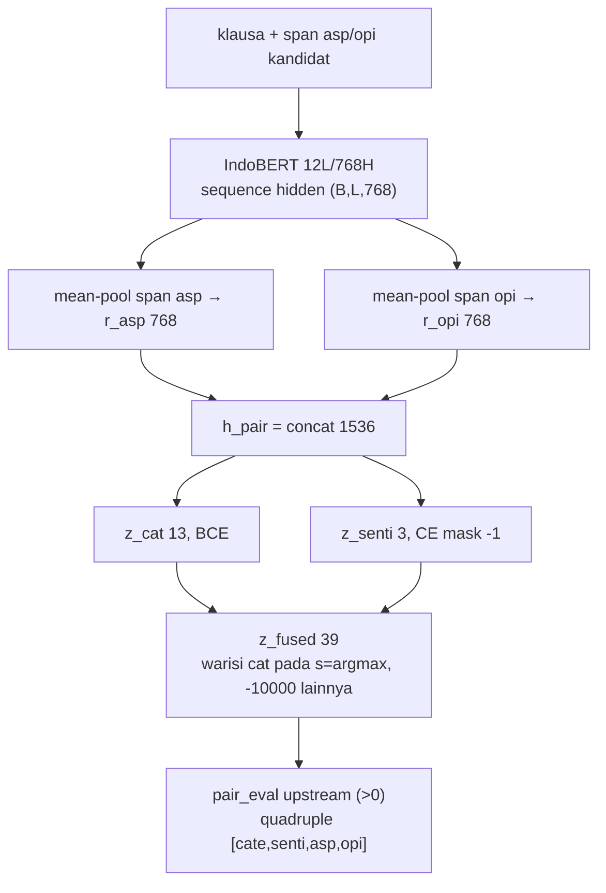
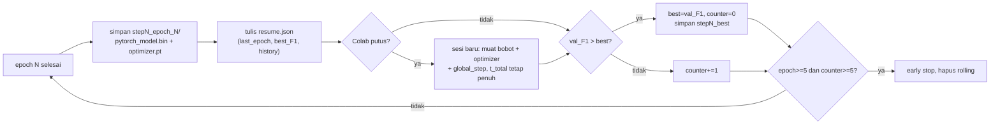

# 032 — Draft Artikel IEEE: ACOS Quadruple Extraction Indonesia dengan IndoBERT (Apps-ACOS)

> Status: **draft interim — belum layak submit**. Step-2 baru 1/15 epoch, Gate-1 belum dijalankan, tanpa CV/multi-seed/gold manusia.
> Sumber angka: reports 023/025/026/027/028/030/031. Tidak ada angka di luar itu.

---

## Metadata submit

- Format: IEEE Trans./Access two-column. Bahasa: Inggris penuh saat submit (draft ini Indonesia untuk review internal).
- Authors: [Nama1 — Affiliasi — Email], [Nama2 — …]. Corresponding: […].
- Index Terms: aspect-based sentiment analysis, ACOS, IndoBERT, Indonesian, weak supervision, reproducibility.
- Fig.1: `reports/img_diagram_bert_vs_indobert.png` — diagram sintesis (bukan hasil ukur). Dasar: spesifikasi backbone identik 12L/768H/12H (report 025), taksonomi 13 kategori + 39 label (report 023 §2.4, `acos_id/taxonomy.py`), single- vs dual-head (reports 027/028), status crash vs. interim (report 030).
- Fig.2: diagram alir + Alg.1 dual-head Step-2 (§IV). Dasar: `acos_id/taxonomy.py` + report 028 §2–3 (rekonstruksi fused-39, BCE+CE termasking).
- Fig.3: `reports/fig3_step1_curve.png` — salinan visual Tabel III. Sumber primer: `ACOS-IndoBERT/notebooks/V4_1_02_step1_train.ipynb` sel 20 (sesi Colab `results/appsid_08092026_150437`, GPU T4 14,46 GB, 8/15 epoch) → `csv/master_03_step1_riwayat.csv` + `plots/03_step1_training_loss_f1_curve.png`.
- Fig.4: `reports/fig4_15subtask.png` — salinan visual Tabel IV. Sumber primer: `ACOS-IndoBERT/notebooks/V4_1_04_eval_inference.ipynb` sel 8–10 (cache `logs/master_metrics.json`, tanpa evaluasi ulang) → `csv/master_08_metrik_subtask.csv` + `plots/05_benchmark_subtasks_f1.png`; dikutip via report 030 §7.
- Fig.5: `reports/fig5_dataset.png` — komposisi dataset. Sumber primer lokal (terverifikasi ulang 11-09-2026): `ACOS-IndoBERT/tokenized_data/_build_report_appsid.json` (baris 60.159/8.027/7.891; quad 72.973/9.587/9.514; `span_invalid: 0`, `unk_disisipkan: 0`) + `ACOS-IndoBERT/data/Apps-ACOS/_build_acos_report.json` (dibuang 4.183 klausa) + `ACOS-IndoBERT/build/_eda_id/csv/eda_dataset_statistics.csv` (sentimen total 45.824/10.404/35.846 dari 92.074 tuple = 49,8/11,3/38,9%; implisit sesuai §III).
- Fig.6: `reports/fig6_split_stability.png` — stabilitas split (sentimen + implisit per split). Sumber: `eda_dataset_statistics.csv` (angka dihitung ulang, cocok).
- Fig.7: `reports/fig7_head_params.png` — parameter single- vs dual-head. Sumber: dimensi Linear dari report 028 §2 (1536→39 vs. 1536→13 + 1536→3).
- Fig.8: diagram alir resume level-3 + early stopping (§IV). Sumber: report 026 §2–5 (rolling checkpoint, PATIENCE=5/MIN=5).
- Tabel V: eksplisit/implisit per split (§III). Tabel VI: slot difficulty Step-2 (§VI, rep. 030 §6.2). Tabel VII: backbone BERT vs IndoBERT (§VI, rep. 030 §4.1 + rep. 025). Tabel VIII: 6 gate verifikasi (§IV, rep. 023 §4).

---

## Title

Aspect–Category–Opinion–Sentiment Quadruple Extraction on Indonesian Digital-Banking Reviews with IndoBERT: The Apps-ACOS Dataset and a Dual-Head Two-Stage Pipeline

## Abstract (150–200 kata, versi submit Inggris)

> ACOS quadruple extraction — (aspect span, category, opinion span, sentiment), including implicit slots — has no established Indonesian benchmark. We present **Apps-ACOS**: 43,673 digital-banking app reviews split into 76,077 clauses (60,159/8,027/7,891 train/dev/test by disjoint `review_id`) with 92,074 weakly labeled tuples (weak-label weights floor 0.3, saturation 2.0). We adapt the Extract-Classify pipeline (Cai et al., 2021) to `indobenchmark/indobert-base-p1` without modifying upstream code, adding six verification gates, per-backbone caching, a `bert.`-prefix re-key adapter, level-3 per-epoch resume with early stopping, and a dual-head Step-2 classifier (13-category BCE + 3-sentiment CE with 39-dim fused reconstruction for backward compatibility). Step-1 (BERT-CRF) reaches 97.94% micro-F1 at epoch 8 on T4; Step-2 reaches 67.86% quadruple F1 at epoch 1/15. A 15-subtask decomposition shows ~8–9 point linear decay per added element with sentiment as bottleneck (84.97% vs. opinion 96.29%). All figures are interim weak-label results. Direct BERT-vs-IndoBERT comparison is invalid due to disjoint datasets.

## Abstrak (ID, ringkas)

> Ekstraksi quadruple ACOS belum memiliki benchmark Indonesia. Kami membangun Apps-ACOS (43.673 ulasan → 76.077 klausa, 92.074 tuple lemah) dan mengadaptasi pipeline Extract-Classify ke IndoBERT tanpa mengubah kode upstream, plus 6 gate verifikasi, re-key prefix `bert.`, resume level-3 + early stopping, dan Step-2 dual-head. Step-1 97,94% (ep-8); Step-2 67,86% (ep-1/15, interim). Perbandingan langsung BERT-vs-IndoBERT tidak valid (dataset berbeda).

---

## I. Introduction

ABSA Indonesia berhenti pada aspek-sentimen. Tugas ACOS menuntut quadruple lengkap dengan slot implisit. Domain ulasan bank digital menambah noise: singkatan, campur kode, tanda baca tanpa spasi (`ribet,bebas`), klausa 3-kata (`bagus`).

Kontribusi yang dapat dipertahankan (bukan klaim SOTA):

1. **Resource:** Apps-ACOS, dataset ACOS Indonesia pertama domain bank digital, dengan sifat weak-label didokumentasikan terbuka.
2. **Method:** adaptasi reproduksibel ke IndoBERT (dua-root, cache per-backbone, 6 gate, dual-head Step-2).
3. **Analysis:** dekomposisi 15 subtask + kuantifikasi error propagation + threats to validity eksplisit.

RQ: (R1) konstruksi data tanpa kehilangan span; (R2) kompatibilitas upstream; (R3) lokasi bottleneck; (R4) batas klaim label-lemah.

## II. Related Work

**ACOS** [1] mendefinisikan quadruple + baseline Extract-Classify: Step-1 BERT-CRF co-extraction, Step-2 klasifikasi gabungan 39 kelas (13×3). Kelemahan bawaan: label gabungan menyembunyikan sumber error; generator `tokenized_data/` tidak dirilis; `measureQuad` ganda-hitung duplikat; parsing `ele[2:]` rapuh (penyebab `KeyError: 'a--1,-1'` pada baseline kami).

**IndoBERT** [2] arsitektur identik dengan BERT-base (12 layer, 768 hidden, 12 head); selisih ~14M parameter hanya embedding (vocab 30.522 vs. 50.000, terpakai 30.521). Risiko spesifik: checkpoint tanpa prefix `bert.` + loader legacy + logging `missing_keys` di-comment (`modeling.py:749–755`) = kegagalan sunyi (encoder acak, hanya gejala F1 rendah).

**Posisi ACOSE:** kolom emosi Apps-ACOS (anger 43,5%, joy 36,9%, fear 0,9%) tidak dipakai di sini. Tanpa anotasi manusia, emosi = renaming deterministik dari sentimen. Jalur quintuple factored-vs-joint (21/22 vs. 195/234) pekerjaan terpisah.

## III. The Apps-ACOS Dataset

Sumber: 13 aplikasi, App Store + Play Store, 43.673 ulasan. Split `review_id`-disjoint. Taksonomi: 13 kategori datar (tanpa `#`), sentimen 0/1/2, `num_labels`=39 (sama dengan rest16 agar head identik). Fig.5 merangkum komposisi.

**Tabel II — Split Apps-ACOS (klausa = 1 baris).**

| Split | Klausa | Tuple | Keterangan |
|---|---|---|---|
| Train | 60.159 | 72.973 | — |
| Dev | 8.027 | 9.587 | — |
| Test | 7.891 | 9.514 | 9,0% teks unik ada di train (median 3 kata) |
| Dibuang | 4.183 | ~4.343 | `review_id` tak di split mana pun |
| Total pakai | 76.077 | 92.074 | weak-label (floor 0,3, saturation 2,0) |

Tiga keputusan terukur:

| Keputusan | Bukti |
|---|---|
| 1 baris = 1 klausa | Span eksplisit terpetakan 100% vs. 61,5% aspek / 48,0% opini pada ulasan utuh; 37,6% klausa tak cocok ke `text_norm` (varian normalisasi beda) |
| Tokenisasi `\w+\|[^\w\s]` | `str.split()` hanya 68,6%/60,0%; 31,4% span hilang |
| Cache per-backbone | Cache bersama = overwrite + vocab salah tanpa error |

Kualitas: retokenisasi IndoBERT 0 `[UNK]`, 0 span rusak, 0 tuple hilang. Sifat wajib lapor: (a) weak-label (angka = kesepakatan dengan pelabel otomatis); (b) 9,0% teks klausa unik test ada di train (14,7% baris test, median 3 kata) — bukan bocor `review_id`, tapi F1 terinflasi; (c) multi-label 0,4% (255/65.423); (d) sentimen negatif 49,8% / netral 11,3% / positif 38,9%; (e) implisit aspek 30,1% / opini 40,6% (deteksi otomatis).

**Tabel V — Eksplisit vs. implisit per split (sumber: `eda_dataset_statistics.csv`).**

| Split | Tuple | Asp-ekspl | Asp-impl (%) | Opi-ekspl | Opi-impl (%) |
|---|---|---|---|---|---|
| Train | 72.973 | 51.184 | 21.789 (29,9) | 43.271 | 29.702 (40,7) |
| Dev | 9.587 | 6.588 | 2.999 (31,3) | 5.836 | 3.751 (39,1) |
| Test | 9.514 | 6.576 | 2.938 (30,9) | 5.693 | 3.821 (40,2) |

**Narasi data (cerita §III).** Ulasan mentah bank digital itu bising: `ribet,bebas` tanpa spasi, singkatan alay, klausa 3-kata. Alur kami: (i) pecah ulasan menjadi klausa — tanpa ini 40% span menjadi implisit palsu; (ii) tokenisasi pemisah tanda baca — tanpa ini 31,4% span hilang; (iii) retokenisasi IndoBERT dengan 0 `[UNK]`. Hasilnya bukan hanya besar (92.074 tuple), tetapi **stabil**: Fig.6 menunjukkan sentimen (negatif ~50%, netral ~11%, positif ~39%) dan proporsi implisit (aspek ~30%, opini ~40%) hampir identik di train/dev/test — artinya pemisah `review_id` tidak menggeser distribusi label, dan detektor implisit otomatis berperilaku konsisten lintas split. Stabilitas inilah yang membuat angka dev/test dapat dibaca sebagai generalisasi, bukan artefak split. Satu noda yang kami biarkan terlihat: 14,7% baris test adalah klausa pendek yang juga muncul di train — F1 pada baris itu lebih mudah dan akan kami laporkan terpisah saat final.

## IV. Method

Pipeline: Step-1 `BertForQuadABSA` (BERT + CRF 6-tag + 2 head implisit) → pasangan Cartesian → Step-2 dual-head baru (Fig.2, Alg.1).

Notasi. Untuk satu kandidat pasangan dalam satu klausa: $H=768$ (hidden IndoBERT-base, identik dengan BERT-base). $r_{asp}, r_{opi} \in \mathbb{R}^{H}$ = mean-pooling hidden states pada token span aspek / opini kandidat (termasuk token implisit `IA/IO` bila slot tak ber-span). $[\cdot\|\cdot]$ = konkatenasi. $W_{cat}\in\mathbb{R}^{13\times1536}$, $W_{senti}\in\mathbb{R}^{3\times1536}$ = satu Linear per head (tanpa hidden tambahan). $y_{cat}\in\{0,1\}^{13}$ = multi-label kategori (0,4% baris punya >1 label, head tetap multi-label demi kompatibilitas); $y_{senti}\in\{0,1,2,-1\}$ = kelas tunggal, $-1$ = pasangan negatif yang di-mask.

**Tabel I — Keterangan simbol rumus.** $B,L$ = ukuran batch, panjang sekuen (MAX_SEQ 128); $H=768$ = dimensi hidden; $r_{asp}, r_{opi}$ = vektor rata-rata span (tetap walau panjang span beda); $h_{pair}$ = vektor gabungan pasangan; $z_{cat}, z_{senti}$ = logit mentah (belum sigmoid/softmax); $\hat{s}$ = indeks sentimen terpilih; $c\in[0,12]$, $s\in\{0,1,2\}$ = indeks kategori/sentimen; $L$ = loss; BCE = satu keputusan ya/tidak per kategori; CE = satu pilihan dari 3 sentimen; $-10000$ = penalti agar logit saingan pasti $<0$ (threshold `pair_eval`).

(1) Fusi span — mengapa 1536. Rata-rata span menekan variasi panjang klausa (5–10 token) menjadi vektor tetap; konkatenasi menjaga informasi aspek dan opini terpisah sebelum klasifikasi, sama seperti baseline agar perbandingan adil:

$$h_{pair}=[r_{asp}\|r_{opi}]\in\mathbb{R}^{1536}$$

Keterangan (1): input = dua vektor 768 (rata-rata hidden span aspek dan opini); operator = konkatenasi; output = satu vektor 1536 sebagai representasi pasangan; dimensi 1536 = 768+768 (bukan hiperparameter baru).

(2) Dual-head — mengapa dipisah. Baseline memakai satu Linear(1536,39) atas cross-product kategori×sentimen: salah kategori otomatis salah sentimen dan keduanya tak terukur mandiri. Kami pecah menjadi dua proyeksi independen dengan loss sesuai tipenya:

$$z_{cat}=W_{cat}h_{pair}\in\mathbb{R}^{13},\quad L_{cat}=BCEWithLogits(z_{cat},y_{cat})$$
$$z_{senti}=W_{senti}h_{pair}\in\mathbb{R}^{3},\quad L_{senti}=CE(z_{senti},y_{senti}),\; ignore\_index=-1$$
$$L_{step2}=L_{cat}+L_{senti}$$

Keterangan (2): $z_{cat}$ = 13 skor kategori independen (sigmoid per dimensi di dalam BCE); $z_{senti}$ = 3 skor sentimen kompetitif (softmax di dalam CE); $ignore\_index=-1$ = pasangan negatif dilewati pada loss sentimen tetapi tetap dihitung pada loss kategori; penjumlahan tanpa bobot (bobot=1, sesuai run ini).

(3) Rekonstruksi fused-39 — mengapa $-10000$. `pair_eval` upstream hanya membaca logit gabungan 39-dim dan threshold $>0$. Agar tanpa ubah `modeling.py`/`eval_metrics.py`, logit gabungan dibentuk dari argmax sentimen $\hat{s}=\arg\max(z_{senti})$: sel $(c,\hat{s})$ mewarisi $z_{cat}[c]$, 2 sel saingan $(c,s\ne\hat{s})$ ditekan $-10000$ sehingga pasti $<0$ dan tak terpilih `np.where`:

$$z_{fused}[c\cdot3+s]=\begin{cases}z_{cat}[c], & s=\hat{s} \\ z_{cat}[c]-10000, & s\ne\hat{s}\end{cases}$$

Contoh: $z_{cat}[TRANSACTION\_TRANSFER]=+2,1$, $\hat{s}=2$ (positif) → $z_{fused}[c\cdot3+2]=+2,1$ (lolos $>0$), dua sel $(c,0),(c,1)$ ≈ $-9998$ (gugur). Jika $z_{cat}[c]<0$ (kategori non-aktif), ketiga sel $<0$ dan tak diprediksi.

Keterangan (3): $c\cdot3+s$ = pemetaan indeks fused-39 (kategori mayor, sentimen minor; $c=0..12$, $s=0..2$); $s=\hat{s}$ = satu-satunya sel per kategori yang boleh lolos; $-10000$ = konstanta penekan (dipilih jauh di bawah rentang logit normal ±5 sehingga hasil pasti negatif tanpa overflow); efek = satu prediksi sentimen per kategori aktif, kompatibel dengan threshold $>0$ milik `pair_eval`.

**Alg.1 — Forward Step-2 dual-head (satu batch).** Input: `hidden (B,L,H)`, `mask_asp/mask_opi (B,L)`, target opsional. 1) `r_asp=mean(hidden[mask_asp])`; `r_opi=mean(hidden[mask_opi])`. 2) `h=dropout(concat)`. 3) `z_cat, z_senti` via dua Linear. 4) Jika train: hitung $L_{cat}+L_{senti}$ (sentimen di-mask $-1$). 5) Jika eval: $\hat{s}$=argmax, bentuk $z_{fused}$ per (3), teruskan ke `pair_eval`.

**Single- vs. dual-head (Tabel + Fig.7).** Perbandingan head Step-2:

| Aspek | Single-head (baseline) | Dual-head (penelitian ini) |
|---|---|---|
| Dimensi | Linear(1536,39) = 59.943 param | Linear(1536,13)+Linear(1536,3) = 24.592 param (~2,4× lebih kecil) |
| Loss | BCE atas 39 sel gabungan | BCE (kategori) + CE termasking (sentimen) |
| Evaluasi mandiri C / S | Tidak bisa | Bisa (category-F1, sentiment-acc) |
| Kompatibilitas `pair_eval` | Asli | Via fused-39 (tanpa ubah upstream) |

**Narasi metode (cerita §IV).** Dua kegagalan sunyi mendorong desain ini. Pertama, encoder bisa acak tanpa pesan error (prefix `bert.` hilang + logging di-comment) — maka Gate-1 numerik bersifat memblokir: merah berarti berhenti, bukan lanjut. Kedua, label gabungan 39 sel menyembunyikan sumber error — maka head dipecah dua: kategori yang multi-label tetap BCE, sentimen yang satu-pilihan memakai CE termasking, lalu digabung kembali hanya untuk memuaskan evaluator lama. Hasil samping yang menguntungkan: head baru 2,4× lebih kecil (Fig.7) sekaligus memberi dua metrik baru yang justru menemukan bug metrik kami sendiri (0,00% karena side-effect tak persist) — bukti bahwa verifikasi bekerja.

**Fig.8 — Resume level-3 + early stopping (sumber: report 026 §2–5).** Keterangan: bobot saja tak cukup (LR meloncat, momentum Adam hilang) — maka optimizer + `global_step` ikut disimpan per epoch; rolling checkpoint lama dihapus agar hemat Drive; resume dinyatakan *statistically equivalent*, bukan bit-identik.

`USE_DUAL_HEAD` hanya untuk domain Indonesia; kontrol Inggris tetap single-head. Protokol: 6 gate (`taxonomy, dataset, acos_build, tokenized, gate2_english, weights`) dengan `raise_on_fail=True`; Gate-1 bandingkan 3 tensor (`torch.equal`), rekey idempoten via `_rekey.json`; resume level-3 (bobot+optimizer+`global_step`, `t_total` penuh) + early stopping (PATIENCE=5, MIN=5); AMP/FP16, batch 32, MAX_SEQ 128, LR 2e-5/5e-5, 15 epoch, SEED 42. Generator notebook deterministik (80 sel/48 kode, MD5 stabil). Split pre-fixed di TSV — tanpa CV (lihat §VII).

**Tabel VIII — 6 gate verifikasi (sumber: report 023 §4; 5 hijau lokal, 1 menunggu Colab).**

| Gate | Yang diperiksa | Hasil |
|---|---|---|
| `taxonomy` | 13 kategori kode == `label_maps.json`, urutan sama | ✅ |
| `dataset` | berkas ada; `review_id` train/dev/test disjoint | ✅ 0 tumpang tindih |
| `acos_build` | tiap span menunjuk token nyata | ✅ 0 rusak |
| `tokenized` | retokenisasi tak hilangkan tuple | ✅ 0 hilang |
| `gate2_english` | regenerasi Inggris identik repo | ✅ (1 kalimat cacat, tercatat) |
| `weights` (Gate-1) | bobot encoder == checkpoint, numerik | ⏳ butuh torch/Colab |

## V. Experiments

Setup: IndoBERT di T4 14,46 GB; baseline BERT-rest16 di A100 (beda GPU tidak memengaruhi F1). Baseline Step-1 81,23% (ep-6, 15/15); Step-2 crash, tanpa metrik end-to-end. IndoBERT Step-1 8/15 epoch; Step-2 1/15 epoch. Dual-head per-head metric 0,00% karena bug (logit side-effect tidak persist saat eval dari cache) — diperbaiki dengan persist ke CSV/JSON.

**Tabel III — Step-1 appsid per-epoch (T4, Fig.3).**

| Ep | Loss | P% | R% | F1% |
|---|---|---|---|---|
| 1 | 2,1422 | 94,19 | 95,89 | 95,03 |
| 2 | 0,5881 | 96,28 | 97,25 | 96,76 |
| 3 | 0,3933 | 96,30 | 98,29 | 97,29 |
| 4 | 0,2903 | 97,10 | 98,15 | 97,63 |
| 5 | 0,2213 | 96,95 | 98,15 | 97,54 |
| 6 | 0,1763 | 97,34 | 98,04 | 97,69 |
| 7 | 0,1330 | 97,14 | 98,28 | 97,71 |
| 8 | 0,0999 | 97,44 | 98,46 | 97,94 |

Bacaan: loss −72% pada ep-1→2; kenaikan ep-4→8 hanya +0,31 (plateau); FN 689→259 (−62%).

## VI. Results and Discussion

**Step-1 (appsid):** 95,03% (ep-1, loss 2,14) → 96,76% (ep-2) → 97,29/97,63/97,54/97,69/97,71 → **97,94% (ep-8, loss 0,0999, P 97,44 R 98,46)**. F1 ≥95% sejak ep-1; kenaikan ep-4→8 hanya +0,31 (plateau). Mudah karena klausa 5–10 token + 60rb klausa/epoch.

**Step-2 (ep-1):** Quad-F1 **67,86%** (P 62,74 R 73,88; TP 6.654 FP 3.951 FN 2.352; loss 0,5544). Lower bound, bukan final.

**Tabel VI — Per difficulty-slot Step-2 ep-1 (sumber: rep. 030 §6.2; slot 3 kosong).**

| Slot | TP | FP | FN | P% | R% | F1% |
|---|---|---|---|---|---|---|
| 0 (termudah) | 2.782 | 239 | 349 | 92,09 | 88,85 | 90,44 |
| 1 | 2.336 | 182 | 248 | 92,77 | 90,40 | 91,57 |
| 2 | 3.655 | 160 | 250 | 95,81 | 93,60 | 94,69 |
| 4 (tersulit) | 7.704 | 561 | 716 | 93,21 | 91,50 | 92,35 |

Anomali: slot-4 ("tersulit") F1-nya tertinggi kedua — definisi difficulty berbasis panjang span tidak tepat, dan slot-4 mendominasi jumlah sampel.

**Tabel VII — Backbone BERT vs. IndoBERT (sumber: rep. 030 §4.1 + rep. 025).**

| Komponen | BERT (`bert-base-uncased`) | IndoBERT (`indobert-base-p1`) |
|---|---|---|
| Layer / hidden / head / pos | 12 / 768 / 12 / 512 | identik |
| Vocab (config / aktual) | 30.522 / 30.522 | 50.000 / 30.521 |
| Total param | ~110M | ~124M (+14M embedding) |
| Prefix `bert.` | Ada (aman) | Tidak ada (wajib rekey + Gate-1) |

**Narasi hasil (cerita §V–VI).** Step-1 adalah kisah tugas yang terlalu mudah: F1 95% sejak epoch-1, lalu merangkak +0,31 poin selama 4 epoch — klausa pendek + 60 ribu contoh/epoch membuat CRF hampir tak punya ruang salah. Step-2 adalah kisah sebaliknya: 1 epoch, F1 67,86%, dan metrik per-komponen yang seharusnya menjadi jawaban justru nol karena bug — model yang dirancang untuk transparansi tersandung transparansinya sendiri. Dekomposisi 15 subtask lalu memberi pola yang rapi dan jujur: tiap elemen baru memangkas ~8–9 poin, dan sentimen selalu menjadi penurun nilai. Tabel VII menutup cerita dengan penolakan klaim: kedua backbone kembar identik kecuali embedding — maka gap 16,7 poin adalah milik dataset (klausa pendek +8–10, data 29× +5–7, domain +2–3), bukan milik model (~0).

**Tabel IV — 15 subtask Step-2 ep-1 (Fig.4).Nilai tertinggi per grup elemen dicetak tebal.**

| #El | Subtask | F1% |
|---|---|---|
| 1 | **opini 96,29** / aspek 93,88 / kategori 92,41 / sentimen 84,97 | avg 91,89 |
| 2 | **cat+asp 90,51** / cat+opi 83,54 / sen+opi 83,33 / asp+opi 81,32 / sen+asp 79,60 / cat+sen 78,60 | avg 82,82 |
| 3 | **cat+asp+opi 78,35** / cat+sen+asp 76,59 / cat+sen+opi 71,33 / sen+asp+opi 68,96 | avg 73,81 |
| 4 | QUAD 66,28 | 66,28 |

Bacaan: decay ~8–9 poin/elemen = error compound; tiap kombinasi bersentimen jatuh (cat+sent terendah di 2-elemen); bottleneck = sentimen (84,97% vs. opini 96,29%).

**Non-klaim:** gap Step-1 16,7 poin (97,94 vs. 81,23) bukan efek backbone. Dekomposisi: klausa pendek +8–10, data 29× (2.484 vs. 72.973) +5–7, domain +2–3, backbone ~0. Perbandingan valid butuh kontrol backbone-sama-dataset-sama (belum ada).

## VII. Threats to Validity

1. Gate-1 belum dijalankan (butuh torch/Colab). Jika gagal, semua angka = head di atas encoder acak.
2. Step-2 1 epoch; angka final butuh 15 epoch + bugfix metrik.
3. Tanpa CV, tanpa multi-seed, tanpa uji signifikansi; klausa pendek berulang menggelembungkan test.
4. Evaluasi weak-label mengukur replikasi noise; butuh gold manusia + κ.
5. Baseline tanpa end-to-end (crash) dan tak dilatih ulang pasca-fix.

## VIII. Conclusion

Resource + protokol reproduksibel + diagnosis bottleneck adalah kontribusi; klaim SOTA ditolak. Lanjut: (1) Gate-1 lalu ulangi bila gagal; (2) 15 epoch + bugfix; (3) lapor subset klausa-unik + bootstrap CI; (4) kontrol cross-lingual rest16-IndoBERT; (5) gold manusia; (6) ACOSE hanya setelah uji H(emosi|sentimen) pada anotasi manusia.

## References (IEEE)

[1] H. Cai, R. Xia, and J. Yu, "Aspect-category-opinion-sentiment quadruple extraction with implicit aspects and opinions," in *Proc. ACL-IJCNLP*, vol. 1, 2021, pp. 340–350.
[2] B. Wilie et al., "IndoNLU: Benchmark and resources for Indonesian NLP," in *Proc. AACL*, 2020, pp. 447–460.
[3] J. Devlin et al., "BERT: Pre-training of deep bidirectional transformers," in *Proc. NAACL-HLT*, 2019, pp. 4171–4186.
[4] M. Pontiki et al., "SemEval-2016 task 5: ABSA," in *Proc. SemEval*, 2016, pp. 19–30.
[5] J. Lafferty, A. McCallum, and F. Pereira, "Conditional random fields," in *Proc. ICML*, 2001, pp. 282–289.
[6] D. Demszky et al., "GoEmotions," in *Proc. ACL*, 2020, pp. 4040–4054.

---

## Checklist pra-submit (tidak masuk naskah)

- [ ] Gate-1 hijau di Colab, `missing_keys`=0, 3 probe `torch.equal`.
- [ ] Step-2 15 epoch penuh + metrik dual-head terisi + `master_metrics.json`.
- [ ] Tabel CI bootstrap + split klausa-unik vs. berulang.
- [ ] Kontrol rest16-IndoBERT (atau nyatakan absen sebagai limitasi).
- [ ] Sampel gold manusia (≥200 klausa, κ dilaporkan).
- [ ] Plot 300 DPI + MD5 generator + hash checkpoint di appendix.
- [ ] Pernyataan etika data toko aplikasi + anonimisasi.
