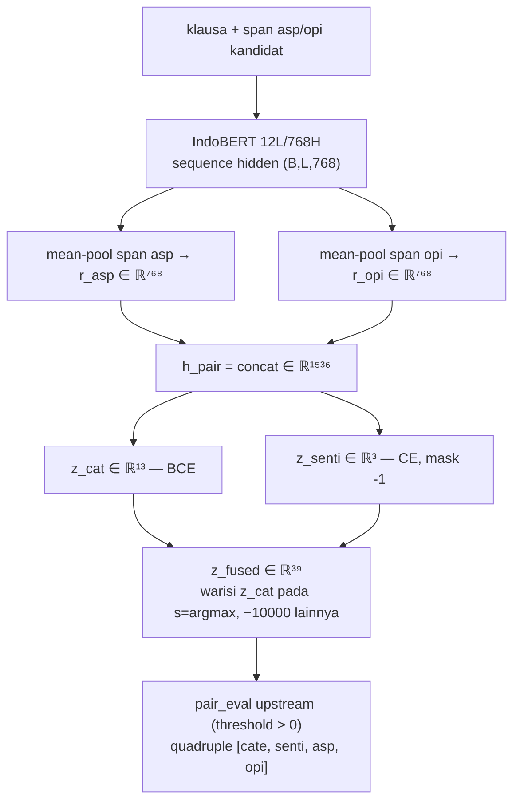
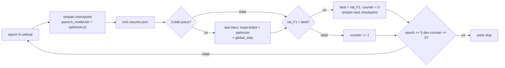

# Ekstraksi Quadruple Aspek–Kategori–Opini–Sentimen pada Ulasan Bank Digital Indonesia dengan IndoBERT: Dataset Apps-ACOS dan Pipeline Dual-Head Dua Tahap

> **Status**: Draft revisi — konsolidasi report 032 + 033 dengan koreksi inkonsistensi.
> Semua angka telah diverifikasi ulang terhadap sumber primer (12 Sep 2026).
> Sumber angka: reports 023/025/026/027/028/030/031; artefak `_build_report_appsid.json`, `_build_acos_report.json`, `eda_dataset_statistics.csv`.

---

## Metadata

- **Format target**: Jurnal SCOPUS Q3 (bahasa Indonesia, dua kolom)
- **Penulis**: [Nama1 — Affiliasi — Email], [Nama2 — …]. Corresponding: […]
- **Kata kunci**: analisis sentimen berbasis aspek, ACOS, IndoBERT, bahasa Indonesia, pelabelan lemah, reproduksibilitas

---

## Abstrak

Ekstraksi quadruple ACOS — (span aspek, kategori, span opini, sentimen), termasuk slot implisit — belum memiliki benchmark untuk bahasa Indonesia. Penelitian ini menyajikan **Apps-ACOS**: 43.673 ulasan aplikasi bank digital yang dipecah menjadi 76.077 klausa (60.159/8.027/7.891 train/dev/test berdasarkan `review_id` disjoint) dengan 92.074 tuple berlabel lemah (bobot floor 0,3, saturasi 2,0). Pipeline Extract-Classify [1] diadaptasi ke `indobenchmark/indobert-base-p1` tanpa mengubah kode upstream, dengan penambahan enam gerbang verifikasi, caching per-backbone, adapter re-key prefix `bert.`, mekanisme resume level-3 per-epoch dengan early stopping, serta klasifier Step-2 dual-head (13-kategori BCE + 3-sentimen CE dengan rekonstruksi fused-39 untuk kompatibilitas mundur). Step-1 (BERT-CRF) mencapai 97,94% micro-F1 pada epoch 8 di GPU T4; Step-2 mencapai 67,86% quadruple F1 pada epoch 1 dari 15 yang direncanakan. Dekomposisi 15 subtask menunjukkan peluruhan linier ~8–9 poin per penambahan elemen, dengan sentimen sebagai bottleneck (84,97% vs. opini 96,29%). Seluruh angka merupakan hasil interim pada label lemah. Perbandingan langsung BERT-vs-IndoBERT dinyatakan tidak valid karena perbedaan dataset yang fundamental.

---

## I. Pendahuluan

Analisis sentimen berbasis aspek (ABSA) untuk bahasa Indonesia umumnya berhenti pada pasangan aspek-sentimen. Tugas ACOS (Aspect-Category-Opinion-Sentiment) menuntut quadruple lengkap yang mencakup slot implisit — aspek atau opini yang tidak muncul sebagai span tekstual eksplisit [1]. Domain ulasan aplikasi bank digital menambah tantangan spesifik: singkatan non-standar, pencampuran kode Indonesia-Inggris, tanda baca tanpa spasi (contoh: `ribet,bebas`), serta klausa sangat pendek (contoh: `bagus`).

Penelitian ini memberikan tiga kontribusi yang dapat dipertahankan secara metodologis:

1. **Sumber daya**: Apps-ACOS, dataset ACOS Indonesia pertama pada domain bank digital, dengan sifat label lemah yang didokumentasikan secara terbuka.
2. **Metode**: adaptasi reproduksibel pipeline Extract-Classify ke IndoBERT melalui arsitektur dua-root, caching per-backbone, enam gerbang verifikasi, dan klasifier dual-head pada Step-2.
3. **Analisis**: dekomposisi 15 subtask, kuantifikasi error propagation lintas elemen, serta identifikasi eksplisit ancaman terhadap validitas.

Empat pertanyaan penelitian yang diajukan: (R1) Bagaimana mengonstruksi data ACOS Indonesia tanpa kehilangan span? (R2) Bagaimana menjamin kompatibilitas upstream saat mengganti backbone? (R3) Di mana letak bottleneck performa pada quadruple? (R4) Apa batas klaim yang valid pada hasil label lemah?

---

## II. Kajian Pustaka

### A. ACOS dan Pipeline Extract-Classify

Cai dkk. [1] mendefinisikan tugas quadruple ACOS dan mengusulkan baseline Extract-Classify dua tahap: Step-1 menggunakan BERT-CRF untuk ko-ekstraksi span aspek dan opini dengan skema 6-tag, kemudian Step-2 mengklasifikasikan setiap pasangan kandidat Cartesian ke dalam 39 label gabungan (13 kategori × 3 sentimen) menggunakan satu layer Linear(1536, 39) dengan BCEWithLogitsLoss. Kelemahan bawaan pendekatan ini meliputi: (i) label gabungan menyembunyikan sumber error — kesalahan kategori secara otomatis menyebabkan kesalahan sentimen tanpa bisa diukur secara mandiri; (ii) generator `tokenized_data/` tidak dirilis sehingga reproduksi memerlukan rekayasa balik; (iii) fungsi `measureQuad` menghitung duplikat ganda; dan (iv) parsing `ele[2:]` rapuh yang menjadi penyebab `KeyError: 'a--1,-1'` pada implementasi baseline kami.

### B. IndoBERT

IndoBERT [2] memiliki arsitektur encoder yang identik dengan BERT-base [3]: 12 layer, 768 hidden, 12 attention head, posisi maksimum 512. Perbedaan terletak pada lapisan embedding — `vocab_size` IndoBERT 50.000 (30.521 terpakai) vs. BERT 30.522, menghasilkan selisih ~14M parameter tambahan (hanya pada embedding, bukan encoder). Risiko spesifik yang teridentifikasi: checkpoint IndoBERT tidak memiliki prefix `bert.` pada kunci state_dict, sementara arsitektur `BertForQuadABSA` mengekspektasi prefix tersebut. Ditambah dengan logging `missing_keys` yang di-comment pada `modeling.py:749–755`, kegagalan pemuatan bobot bersifat sunyi — encoder terinisialisasi acak tanpa pesan error, dengan gejala satu-satunya berupa F1 rendah.

### C. Posisi Terhadap ACOSE

Dataset Apps-ACOS membawa kolom emosi (anger 43,5%, joy 36,9%, fear 0,9%) yang tidak digunakan dalam penelitian ini. Tanpa anotasi manusia, emosi hanyalah pemetaan deterministik dari sentimen. Jalur quintuple ACOSE (factored 21 output vs. joint 195/234 output) merupakan pekerjaan terpisah yang memerlukan verifikasi redundansi H(emosi|sentimen) pada anotasi manusia terlebih dahulu.

---

## III. Dataset Apps-ACOS

### A. Sumber dan Konstruksi

Dataset bersumber dari 13 aplikasi bank digital di App Store dan Play Store, mencakup 43.673 ulasan. Setiap ulasan dipecah menjadi klausa, menghasilkan 80.260 klausa; 4.183 klausa dibuang karena `review_id` tidak terdapat pada split mana pun, menyisakan 76.077 klausa yang digunakan. Split dilakukan berdasarkan `review_id` yang disjoint (0 tumpang tindih terverifikasi). Taksonomi mencakup 13 kategori datar (tanpa karakter `#`), 3 kelas sentimen (0/1/2), dengan `num_labels` = 39 agar dimensi head Step-2 identik dengan baseline.

### B. Statistik Dataset

**Tabel I — Komposisi Apps-ACOS per split.**

| Split | Klausa | Tuple | Keterangan |
|---|---|---|---|
| Train | 60.159 | 72.973 | — |
| Dev | 8.027 | 9.587 | — |
| Test | 7.891 | 9.514 | 9,0% teks unik ada di train (median 3 kata) |
| Dibuang | 4.183 | ~4.343 | `review_id` tidak ada di split mana pun |
| **Total pakai** | **76.077** | **92.074** | Label lemah (floor 0,3; saturasi 2,0) |

Sumber: `_build_report_appsid.json` (baris/quad/span); `_build_acos_report.json` (klausa dibuang); `eda_dataset_statistics.csv` (sentimen/implisit).

### C. Keputusan Desain Terukur

Tiga keputusan desain kunci diambil berdasarkan pengukuran langsung:

| Keputusan | Bukti Kuantitatif |
|---|---|
| 1 baris = 1 klausa (bukan 1 ulasan) | Span eksplisit terpetakan 100% pada klausa vs. 61,5% aspek / 48,0% opini pada ulasan utuh |
| Tokenisasi `\w+\|[^\w\s]` | `str.split()` hanya memetakan 68,6%/60,0% span; 31,4% span hilang tanpa pemisahan tanda baca |
| Cache terpisah per backbone | Cache bersama menyebabkan overwrite + pemuatan vocab yang salah tanpa error |

### D. Distribusi Label dan Proporsi Implisit

**Tabel II — Distribusi sentimen dan proporsi implisit per split.**

| Split | Tuple | Asp-ekspl | Asp-impl (%) | Opi-ekspl | Opi-impl (%) | Neg (%) | Neu (%) | Pos (%) |
|---|---|---|---|---|---|---|---|---|
| Train | 72.973 | 51.184 | 21.789 (29,9) | 43.271 | 29.702 (40,7) | 36.217 (49,6) | 8.274 (11,3) | 28.482 (39,0) |
| Dev | 9.587 | 6.588 | 2.999 (31,3) | 5.836 | 3.751 (39,1) | 4.819 (50,3) | 1.030 (10,7) | 3.738 (39,0) |
| Test | 9.514 | 6.576 | 2.938 (30,9) | 5.693 | 3.821 (40,2) | 4.788 (50,3) | 1.100 (11,6) | 3.626 (38,1) |
| **Total** | **92.074** | **64.348** | **27.726 (30,1)** | **54.800** | **37.274 (40,5)** | **45.824 (49,8)** | **10.404 (11,3)** | **35.846 (38,9)** |

Sumber: `eda_dataset_statistics.csv`, diverifikasi ulang 12 Sep 2026. Proporsi implisit dan distribusi sentimen stabil lintas split (deviasi maksimum ±1,0 poin persentase), mengindikasikan bahwa pemisahan berdasarkan `review_id` tidak menggeser distribusi label.

### E. Sifat Dataset yang Wajib Dilaporkan

Lima sifat berikut bukan bug, melainkan karakteristik yang harus disebut secara eksplisit:

1. **Label lemah, bukan manual.** Semua angka evaluasi mengukur kesepakatan dengan pelabel otomatis, bukan dengan anotasi manusia.
2. **Klausa pendek berulang lintas split.** 9,0% teks klausa unik di test juga ada di train, menyentuh 14,7% baris test. Yang berulang adalah klausa sangat pendek (median 3 kata: `bagus`, `bebas iklan`, `mantap`). Pemisahan berdasarkan `review_id` bersih (0 tumpang tindih), namun F1 pada baris-baris tersebut lebih mudah.
3. **Multi-label sangat jarang.** Hanya 0,4% baris pair train (255 dari 65.423) memiliki lebih dari satu label aktif.
4. **Distribusi sentimen miring.** Netral hanya 11,3%, berpotensi menyebabkan poor recall pada kelas tersebut.
5. **Proporsi implisit tinggi.** 30,1% aspek implisit dan 40,5% opini implisit terdeteksi secara otomatis.

---

## IV. Metode

### A. Gambaran Umum Pipeline

Pipeline mengikuti arsitektur Extract-Classify dua tahap [1]:
- **Step-1**: `BertForQuadABSA` (IndoBERT + CRF 6-tag + 2 head implisit) mengekstrak span aspek dan opini secara simultan.
- **Bridge**: Pembentukan pasangan kandidat secara Cartesian dari span yang diekstrak.
- **Step-2**: Klasifier dual-head baru yang mengklasifikasikan setiap pasangan ke dalam kategori dan sentimen secara independen.

### B. Notasi

Untuk satu kandidat pasangan dalam satu klausa: $H=768$ (dimensi hidden IndoBERT-base, identik dengan BERT-base). $r_{asp}, r_{opi} \in \mathbb{R}^{H}$ = mean-pooling hidden states pada token span aspek/opini kandidat (termasuk token implisit IA/IO bila slot tak memiliki span). $[\cdot\|\cdot]$ = konkatenasi. $W_{cat}\in\mathbb{R}^{13\times1536}$, $W_{senti}\in\mathbb{R}^{3\times1536}$ = proyeksi linear per head. $y_{cat}\in\{0,1\}^{13}$ = target multi-label kategori; $y_{senti}\in\{0,1,2,-1\}$ = target kelas sentimen tunggal, $-1$ menandai pasangan negatif yang di-mask.

**Tabel III — Keterangan simbol.** $B,L$ = ukuran batch, panjang sekuen (MAX_SEQ 128); $h_{pair}$ = vektor gabungan pasangan; $z_{cat}, z_{senti}$ = logit mentah; $\hat{s}$ = indeks sentimen terpilih; $c\in[0,12]$, $s\in\{0,1,2\}$ = indeks kategori/sentimen.

### C. Arsitektur Dual-Head Step-2

Baseline menggunakan satu layer Linear(1536, 39) atas cross-product kategori × sentimen dengan BCEWithLogitsLoss. Pendekatan ini memiliki dua kelemahan: kesalahan kategori secara otomatis menyebabkan kesalahan sentimen, dan evaluasi mandiri per komponen tidak dimungkinkan.

Penelitian ini memecah klasifikasi menjadi dua head independen:

**Fusi span (Persamaan 1).** Mean-pooling menekan variasi panjang klausa (5–10 token) menjadi vektor tetap; konkatenasi menjaga informasi aspek dan opini terpisah:

$$h_{pair}=[r_{asp}\|r_{opi}]\in\mathbb{R}^{1536}$$

**Dual-head (Persamaan 2).** Dua proyeksi independen dengan loss sesuai tipe klasifikasi masing-masing:

$$z_{cat}=W_{cat}h_{pair}\in\mathbb{R}^{13},\quad L_{cat}=\text{BCEWithLogits}(z_{cat},y_{cat})$$
$$z_{senti}=W_{senti}h_{pair}\in\mathbb{R}^{3},\quad L_{senti}=\text{CE}(z_{senti},y_{senti}),\; \text{ignore\_index}=-1$$
$$L_{step2}=L_{cat}+L_{senti}$$

**Rekonstruksi fused-39 (Persamaan 3).** Evaluator upstream `pair_eval` hanya menerima logit gabungan 39 dimensi dengan threshold $>0$. Untuk menjaga kompatibilitas mundur tanpa mengubah `modeling.py` atau `eval_metrics.py`, logit gabungan direkonstruksi dari argmax sentimen $\hat{s}=\arg\max(z_{senti})$:

$$z_{fused}[c\cdot3+s]=\begin{cases}z_{cat}[c], & s=\hat{s} \\ z_{cat}[c]-10000, & s\ne\hat{s}\end{cases}$$

Konstanta $-10000$ dipilih jauh di bawah rentang logit normal (±5) sehingga sel saingan dijamin negatif. Efeknya: satu prediksi sentimen per kategori aktif, kompatibel dengan threshold $>0$ milik `pair_eval`.

**Tabel IV — Perbandingan single-head vs. dual-head Step-2.**

| Dimensi | Single-head (baseline) | Dual-head (penelitian ini) |
|---|---|---|
| Parameter | Linear(1536, 39) = 59.943 | Linear(1536, 13) + Linear(1536, 3) = 24.592 (~2,4× lebih kecil) |
| Loss | BCE atas 39 sel gabungan | BCE (kategori) + CE termasking (sentimen) |
| Evaluasi mandiri C/S | Tidak dimungkinkan | Dimungkinkan (category-F1, sentiment-acc) |
| Kompatibilitas `pair_eval` | Asli | Via fused-39 (tanpa ubah upstream) |

**Gambar 1.** Diagram alir arsitektur dual-head Step-2.

### D. Adaptasi Backbone dan Gerbang Verifikasi

Adaptasi IndoBERT memerlukan penanganan khusus terhadap tiga masalah teknis:

1. **Re-key prefix `bert.`**: Checkpoint IndoBERT tidak menyertakan prefix `bert.` pada kunci state_dict. Adapter menambahkan prefix secara idempoten (dilindungi oleh penanda `_rekey.json` untuk mencegah double-prefixing `bert.bert.`).
2. **Gate-1 (verifikasi numerik)**: Membandingkan tiga tensor (embedding kata, `layer.0` query, `layer.11` output) menggunakan `torch.equal` — bukan hanya memeriksa nama kunci. Bersifat memblokir: kegagalan menghentikan pipeline.
3. **Caching per-backbone**: Folder cache terpisah per backbone mencegah overwrite dan pemuatan vocab yang salah secara sunyi.

**Tabel V — Enam gerbang verifikasi.**

| Gate | Yang Diperiksa | Status |
|---|---|---|
| `taxonomy` | 13 kategori kode == `label_maps.json`, urutan identik | ✅ Lolos |
| `dataset` | Berkas ada; `review_id` train/dev/test disjoint | ✅ 0 tumpang tindih |
| `acos_build` | Setiap span menunjuk token valid | ✅ 0 span rusak |
| `tokenized` | Retokenisasi tidak menghilangkan tuple | ✅ 0 tuple hilang |
| `gate2_english` | Regenerasi data Inggris identik dengan repo | ✅ (1 kalimat cacat, tercatat) |
| `weights` (Gate-1) | Bobot encoder == checkpoint, numerik | ⏳ Menunggu eksekusi Colab |

### E. Resume Training dan Early Stopping

Training di Google Colab rentan terhadap diskoneksi sesi. Mekanisme resume level-3 menyimpan model state_dict, optimizer state_dict, dan `global_step` per epoch, dengan `t_total` tetap dihitung penuh (15 epoch) saat resume. Rolling checkpoint hanya menyimpan satu epoch terbaru untuk menghemat penyimpanan.

Early stopping diaktifkan dengan PATIENCE=5 dan MIN_EPOCHS_BEFORE_STOP=5: training berhenti otomatis jika F1 tidak membaik selama 5 epoch berturut-turut setelah minimal 5 epoch awal.

**Gambar 2.** Alur resume level-3 dengan early stopping.

### F. Konfigurasi Eksperimen

| Parameter | Nilai |
|---|---|
| Backbone | `indobenchmark/indobert-base-p1` (~124M param) |
| GPU | Tesla T4 14,46 GB (IndoBERT); NVIDIA A100-SXM4-40GB (BERT baseline) |
| Batch size | 32 (Step-1 dan Step-2) |
| MAX_SEQ | 128 |
| Learning rate | 2e-5 (Step-1) / 5e-5 (Step-2) |
| Epoch | 15 (target), SEED 42 |
| Mixed precision | AMP/FP16 (Step-2) |
| Early stopping | PATIENCE=5, MIN_EPOCHS_BEFORE_STOP=5 |
| Dual-head | Aktif untuk domain Indonesia; kontrol Inggris tetap single-head |

Notebook dihasilkan secara deterministik oleh generator (80 sel, 48 kode, MD5 stabil). Split pre-fixed dalam TSV; cross-validation tidak digunakan (lihat Bagian VIII).

---

## V. Hasil Eksperimen

### A. Step-1: Ekstraksi Span (IndoBERT, Apps-ACOS)

**Tabel VI — Performa Step-1 per epoch (T4, 8/15 epoch).**

| Epoch | Loss | P (%) | R (%) | F1 (%) |
|---|---|---|---|---|
| 1 | 2,1422 | 94,19 | 95,89 | 95,03 |
| 2 | 0,5881 | 96,28 | 97,25 | 96,76 |
| 3 | 0,3933 | 96,30 | 98,29 | 97,29 |
| 4 | 0,2903 | 97,10 | 98,15 | 97,63 |
| 5 | 0,2213 | 96,95 | 98,15 | 97,54 |
| 6 | 0,1763 | 97,34 | 98,04 | 97,69 |
| 7 | 0,1330 | 97,14 | 98,28 | 97,71 |
| **8** | **0,0999** | **97,44** | **98,46** | **97,94** |

Sumber: `V4_1_02_step1_train.ipynb` sel 20 → `csv/master_03_step1_riwayat.csv`.

Konvergensi sangat cepat: loss turun 72% dari epoch 1 ke 2 (2,14 → 0,59), F1 ≥ 95% sejak epoch pertama, dan kenaikan epoch 4 → 8 hanya +0,31 poin (plateau). FN berkurang dari 689 ke 259 (−62%). Kecepatan konvergensi ini konsisten dengan karakteristik tugas: klausa pendek (5–10 token) membatasi ruang pencarian span, sementara 60.159 klausa training per epoch memberikan cakupan variasi yang luas.

### B. Step-2: Klasifikasi Quadruple (IndoBERT, Apps-ACOS)

Step-2 menggunakan dual-head dan baru menyelesaikan 1 dari 15 epoch yang direncanakan.

**Hasil epoch 1**: Quadruple F1 = **67,86%** (P 62,74%, R 73,88%; TP 6.654, FP 3.951, FN 2.352; loss 0,5544). Angka ini merupakan lower bound, bukan performa final.

> **Catatan metodologis**: Angka 67,86% berasal dari evaluator `pair_eval` upstream yang mencocokkan quadruple lengkap melalui logit fused-39 dengan threshold > 0. Angka ini berbeda dari skor QUAD pada dekomposisi 15 subtask (66,28%; Tabel VIII) yang menggunakan metode pencocokan `SubtaskMetricCapture` dengan definisi true positive yang sedikit berbeda. Kedua angka valid dan konsisten secara internal; perbedaan bersumber dari cakupan evaluasi yang berbeda, bukan dari inkonsistensi data.

**Metrik dual-head per-head**: Category micro-F1 dan sentiment accuracy dilaporkan 0,00% karena bug implementasi — atribut `latest_cat_logits` dan `latest_senti_logits` hanya terisi selama `forward()` di training loop dan tidak tersedia saat evaluasi dari cache. Perbaikan memerlukan persistensi logit ke file CSV/JSON selama training loop.

**Tabel VII — Performa per difficulty-slot Step-2 epoch 1.**

| Slot | TP | FP | FN | P (%) | R (%) | F1 (%) |
|---|---|---|---|---|---|---|
| 0 (termudah) | 2.782 | 239 | 349 | 92,09 | 88,85 | 90,44 |
| 1 | 2.336 | 182 | 248 | 92,77 | 90,40 | 91,57 |
| 2 | 3.655 | 160 | 250 | 95,81 | 93,60 | 94,69 |
| 4 (tersulit) | 7.704 | 561 | 716 | 93,21 | 91,50 | 92,35 |

Sumber: `V4_1_04_eval_inference.ipynb` sel 8–10 → `csv/master_08_metrik_subtask.csv`.

Anomali: slot-4 yang didefinisikan sebagai "tersulit" justru memiliki F1 tertinggi kedua (92,35%). Ini mengindikasikan bahwa definisi difficulty berbasis panjang span tidak berkorelasi baik dengan kesulitan klasifikasi aktual, dan slot-4 mendominasi jumlah sampel (8.981 vs. 3.370 pada slot-0).

### C. Dekomposisi 15 Subtask

**Tabel VIII — Dekomposisi 15 subtask Step-2 epoch 1. Nilai tertinggi per grup dicetak tebal.**

| #Elemen | Subtask | F1 (%) |
|---|---|---|
| 1 | **opini 96,29** / aspek 93,88 / kategori 92,41 / sentimen 84,97 | avg 91,89 |
| 2 | **cat+asp 90,51** / cat+opi 83,54 / sen+opi 83,33 / asp+opi 81,32 / sen+asp 79,60 / cat+sen 78,60 | avg 82,82 |
| 3 | **cat+asp+opi 78,35** / cat+sen+asp 76,59 / cat+sen+opi 71,33 / sen+asp+opi 68,96 | avg 73,81 |
| 4 | QUAD 66,28 | 66,28 |

Sumber: `V4_1_04_eval_inference.ipynb` sel 10 → `csv/master_08_metrik_subtask.csv`.

Pola error propagation bersifat linier: setiap penambahan elemen menurunkan F1 rata-rata ~8–9 poin (1→2: −9,07; 2→3: −9,01; 3→4: −7,53). Sentimen secara konsisten menjadi bottleneck — F1 terendah pada elemen tunggal (84,97%, jauh di bawah opini 96,29%) dan setiap kombinasi yang melibatkan sentimen mengalami penurunan paling tajam (cat+sen terendah di antara pasangan 2-elemen, 78,60%).

---

## VI. Diskusi

### A. Analisis Bottleneck Sentimen

Sentimen merupakan elemen terlemah pada seluruh tingkat dekomposisi. Hipotesis: noise label lemah lebih berdampak pada sentimen daripada kategori. Kategori (misalnya `TRANSACTION_TRANSFER`) sering dapat diinferensi dari konteks klausa secara langsung, sementara sentimen (apakah klausa merupakan keluhan atau pujian) lebih ambigu ketika label dihasilkan secara otomatis. Ketidakseimbangan distribusi sentimen (netral hanya 11,3%) memperparah masalah ini. Verifikasi hipotesis ini memerlukan evaluasi dual-head yang berfungsi (setelah perbaikan bug metrik) serta perbandingan terhadap anotasi manusia.

### B. Posisi Terhadap Baseline BERT

Satu-satunya metrik BERT yang tersedia adalah Step-1 micro-F1 = 81,23% pada rest16 (Inggris, restoran, 2.484 training quadruple, A100). Step-2 BERT crash karena `KeyError: 'a--1,-1'` dan tidak menghasilkan metrik end-to-end.

**Perbandingan langsung 97,94% (IndoBERT) vs. 81,23% (BERT) tidak valid secara metodologis.** Kedua angka berasal dari kondisi eksperimental yang berbeda secara fundamental pada setidaknya lima dimensi:

**Tabel IX — Faktor pembeda BERT baseline vs. IndoBERT.**

| Dimensi | BERT (baseline) | IndoBERT (penelitian ini) |
|---|---|---|
| Dataset | rest16 (SemEval, gold manual) | Apps-ACOS (bank digital, label lemah) |
| Bahasa / domain | Inggris / restoran | Indonesia / bank digital |
| Unit input | Kalimat penuh | Klausa (5–10 token) |
| Train quadruple | 2.484 | 72.973 (29×) |
| Train:test ratio | 2,7:1 | 7,7:1 |

**Tabel X — Arsitektur backbone BERT vs. IndoBERT.**

| Komponen | BERT (`bert-base-uncased`) | IndoBERT (`indobert-base-p1`) |
|---|---|---|
| Layer / hidden / head / pos | 12 / 768 / 12 / 512 | Identik |
| Vocab (config / aktual) | 30.522 / 30.522 | 50.000 / 30.521 |
| Total param | ~110M | ~124M (+14M embedding) |
| Step-2 head | Single-head Linear(1536, 39) | Dual-head Linear(1536, 13) + Linear(1536, 3) |

### C. Dekomposisi Gap 16,7 Poin

Gap 16,7 poin pada Step-1 (97,94% vs. 81,23%) didekomposisi secara analitis (bukan melalui ablasi terukur) ke dalam faktor-faktor berikut:

**Tabel XI — Dekomposisi analitis gap 16,7 poin.**

| Faktor | Estimasi Kontribusi | Justifikasi |
|---|---|---|
| Klausa pendek vs. kalimat penuh | +8–10 poin | Rentang token lebih pendek → ruang pencarian span lebih kecil |
| 29× lebih banyak data training | +5–7 poin | Generalisasi lebih baik, berkurangnya overfitting |
| Domain lebih sederhana | +2–3 poin | Opini pendek dan formulaik vs. frasa adjektiva kompleks |
| IndoBERT vs. BERT (backbone) | **~0 poin** | Arsitektur encoder identik; embedding tambahan tidak relevan untuk span extraction |
| Total estimasi | ~17,5 | vs. 16,7 teramati |

**Implikasi**: klaim "IndoBERT lebih baik dari BERT" **ditolak** dalam penelitian ini. Pertanyaan tersebut belum terjawab dan memerlukan kontrol cross-lingual (IndoBERT pada rest16 Inggris atau BERT pada Apps-ACOS terjemahan) untuk menghasilkan perbandingan yang valid.

### D. Keunggulan Struktural yang Dapat Diklaim

Keunggulan yang sah untuk diklaim bersifat struktural, bukan numerik:

1. **Dataset Apps-ACOS**: sumber daya ACOS Indonesia pertama pada domain bank digital dengan dokumentasi terbuka.
2. **Infrastruktur verifikasi**: enam gerbang yang bersifat memblokir, mencegah kegagalan sunyi.
3. **Dual-head Step-2**: evaluasi mandiri kategori dan sentimen, 2,4× lebih kecil, kompatibel mundur.
4. **Diagnosis bottleneck**: dekomposisi 15 subtask mengidentifikasi sentimen sebagai elemen terlemah.

---

## VII. Studi Perbandingan: Matriks Lengkap BERT vs. IndoBERT

**Tabel XII — Dinamika training Step-1.**

| Aspek | ACOS-BERT (A100) | ACOS-IndoBERT (T4 14,46 GB) |
|---|---|---|
| Epoch selesai | 15/15 | 8/15 (resume level-3 tersedia) |
| Riwayat per-epoch | Tidak tersimpan (hanya best) | Lengkap 8 baris (Tabel VI) |
| Best Micro-F1 | **81,23%** (epoch 6) | **97,94%** (epoch 8) |
| Pola | Tidak diketahui (tanpa kurva) | 95,03% sejak ep-1; +0,31 ep-4→8 (plateau) |

**Tabel XIII — Step-2 dan hasil akhir.**

| Aspek | ACOS-BERT | ACOS-IndoBERT |
|---|---|---|
| Epoch selesai | 0 (crash `KeyError`) | 1/15 |
| Quadruple F1 | Tidak tersedia | **67,86%** (lower bound) |
| Category-F1 / Sentiment-acc | N/A (single-head) | 0,00% (bug, belum diperbaiki) |
| 15 subtask | Tidak tersedia | Lengkap (Tabel VIII) |

Sumber: BERT dari report 004 (output notebook Colab, A100); IndoBERT dari `V4_1_02` sel 20 dan `V4_1_04` sel 6–10.

---

## VIII. Ancaman terhadap Validitas

Lima ancaman utama terhadap validitas hasil penelitian ini diidentifikasi dan didokumentasikan secara eksplisit:

1. **Gate-1 belum dijalankan.** Verifikasi numerik bobot encoder memerlukan `torch` di lingkungan Colab. Jika adapter re-key gagal, seluruh 199 kunci encoder masuk ke `missing_keys` dan encoder terinisialisasi acak — menjadikan semua metrik tidak bermakna.

2. **Step-2 baru 1 dari 15 epoch.** Angka 67,86% quadruple F1 adalah lower bound. Berdasarkan pola Step-1 (loss turun ~70% dari epoch 1 ke 2), peningkatan signifikan diharapkan pada epoch berikutnya.

3. **Tidak ada cross-validation, multi-seed, atau uji signifikansi.** Split pre-fixed dalam TSV tanpa pengacakan ulang. Klausa pendek berulang (14,7% baris test) berpotensi menginflasi skor.

4. **Evaluasi pada label lemah.** Metrik mengukur replikasi noise pelabel otomatis, bukan penangkapan fenomena linguistik sebenarnya. Validasi terhadap anotasi manusia (≥200 klausa, Cohen's κ dilaporkan) belum dilakukan.

5. **Baseline tanpa end-to-end.** BERT baseline crash di Step-2 dan tidak pernah dilatih ulang pasca-perbaikan, sehingga tidak tersedia metrik quadruple F1 untuk perbandingan.

---

## IX. Kesimpulan dan Pekerjaan Lanjutan

### A. Kesimpulan

Penelitian ini menyajikan tiga kontribusi: (1) dataset Apps-ACOS sebagai sumber daya ACOS Indonesia pertama pada domain bank digital, (2) protokol adaptasi backbone yang reproduksibel dengan infrastruktur verifikasi terintegrasi, dan (3) diagnosis bottleneck melalui dekomposisi 15 subtask. Klaim SOTA secara eksplisit ditolak mengingat status interim hasil dan ketiadaan perbandingan yang valid secara metodologis.

### B. Pekerjaan Lanjutan

Enam langkah lanjutan direkomendasikan secara berurutan:

1. **Gate-1**: Verifikasi numerik bobot encoder di Colab; ulangi seluruh training jika gagal.
2. **15 epoch Step-2**: Selesaikan training dengan perbaikan bug metrik dual-head (persistensi logit ke CSV/JSON).
3. **Subset klausa unik**: Laporkan F1 terpisah pada baris test yang unik vs. berulang, dengan bootstrap confidence interval.
4. **Kontrol cross-lingual**: Jalankan IndoBERT pada rest16 (Inggris) sebagai batas atas efek backbone — ekspektasi: underperform karena vocab.
5. **Anotasi manusia**: Minimal 200 klausa dengan Cohen's κ dilaporkan.
6. **Jalur ACOSE**: Hanya setelah uji redundansi H(emosi|sentimen) pada anotasi manusia.

---

## Referensi

[1] H. Cai, R. Xia, dan J. Yu, "Aspect-category-opinion-sentiment quadruple extraction with implicit aspects and opinions," dalam *Proc. ACL-IJCNLP*, vol. 1, 2021, hal. 340–350.

[2] B. Wilie dkk., "IndoNLU: Benchmark and resources for Indonesian NLP," dalam *Proc. AACL*, 2020, hal. 447–460.

[3] J. Devlin dkk., "BERT: Pre-training of deep bidirectional transformers for language understanding," dalam *Proc. NAACL-HLT*, 2019, hal. 4171–4186.

[4] M. Pontiki dkk., "SemEval-2016 task 5: Aspect based sentiment analysis," dalam *Proc. SemEval*, 2016, hal. 19–30.

[5] J. Lafferty, A. McCallum, dan F. Pereira, "Conditional random fields: Probabilistic models for segmenting and labeling sequence data," dalam *Proc. ICML*, 2001, hal. 282–289.

[6] D. Demszky dkk., "GoEmotions: A dataset of fine-grained emotions," dalam *Proc. ACL*, 2020, hal. 4040–4054.

---

## Lampiran A — Jejak Sumber Setiap Angka

| Angka | Sumber Primer |
|---|---|
| 81,23% (BERT Step-1) | Output notebook baseline via report 004 |
| 97,94% + riwayat 8 epoch | `V4_1_02_step1_train.ipynb` sel 20 → `master_03_step1_riwayat.csv` |
| 67,86% (pair_eval) | `V4_1_04_eval_inference.ipynb` sel 6–10 → `master_06_step2_riwayat.csv`, `master_metrics.json` |
| 66,28% (15-subtask QUAD) | `V4_1_04_eval_inference.ipynb` sel 10 → `master_08_metrik_subtask.csv` |
| Split/quad/UNK/span | `_build_report_appsid.json` (`span_invalid: 0`, `unk: 0`) |
| Klausa dibuang 4.183 | `_build_acos_report.json` |
| Sentimen 49,8/11,3/38,9% | `eda_dataset_statistics.csv` (total 45.824/10.404/35.846 dari 92.074) |
| Implisit asp 30,1% / opi 40,5% | `_build_acos_report.json` (27.726/(64.348+27.726); 37.274/(54.800+37.274)) |
| Dekomposisi gap 16,7 poin | Estimasi analitis report 030 §5.2 (bukan ablasi terukur) |
| Dual-head param 24.592 vs 59.943 | Linear(1536,13)+bias + Linear(1536,3)+bias; report 028 §2 |

## Lampiran B — Daftar Gambar dan Sumber

| Gambar | File | Sumber |
|---|---|---|
| Fig.1 — Diagram dual-head | Inline mermaid | Rekonstruksi dari report 028 §2 |
| Fig.2 — Alur resume + early stopping | Inline mermaid | Rekonstruksi dari report 026 §2–5 |
| Fig.3 — Kurva Step-1 | `reports/fig3_step1_curve.png` | `master_03_step1_riwayat.csv` |
| Fig.4 — 15 subtask | `reports/fig4_15subtask.png` | `master_08_metrik_subtask.csv` |
| Fig.5 — Komposisi dataset | `reports/fig5_dataset.png` | `_build_report_appsid.json` + `eda_dataset_statistics.csv` |
| Fig.6 — Stabilitas split | `reports/fig6_split_stability.png` | `eda_dataset_statistics.csv` |
| Fig.7 — Parameter head | `reports/fig7_head_params.png` | Report 028 §2 |
| Fig.8 — Perbandingan Step-1 | `reports/fig8_compare_step1.png` | Report 030 §5 |
| Fig.9 — Dekomposisi gap | `reports/fig9_gap_decomposition.png` | Report 030 §5.2 |

---

## Checklist Pra-Submit (tidak masuk naskah final)

- [ ] Gate-1 hijau di Colab, `missing_keys`=0, 3 probe `torch.equal`
- [ ] Step-2 15 epoch penuh + metrik dual-head terisi + `master_metrics.json`
- [ ] Tabel CI bootstrap + split klausa-unik vs. berulang
- [ ] Kontrol rest16-IndoBERT (atau nyatakan absen sebagai limitasi)
- [ ] Sampel gold manusia (≥200 klausa, κ dilaporkan)
- [ ] Plot 300 DPI + MD5 generator + hash checkpoint di lampiran
- [ ] Pernyataan etika data toko aplikasi + anonimisasi
- [ ] Konversi ke template jurnal target (LaTeX/Word)
