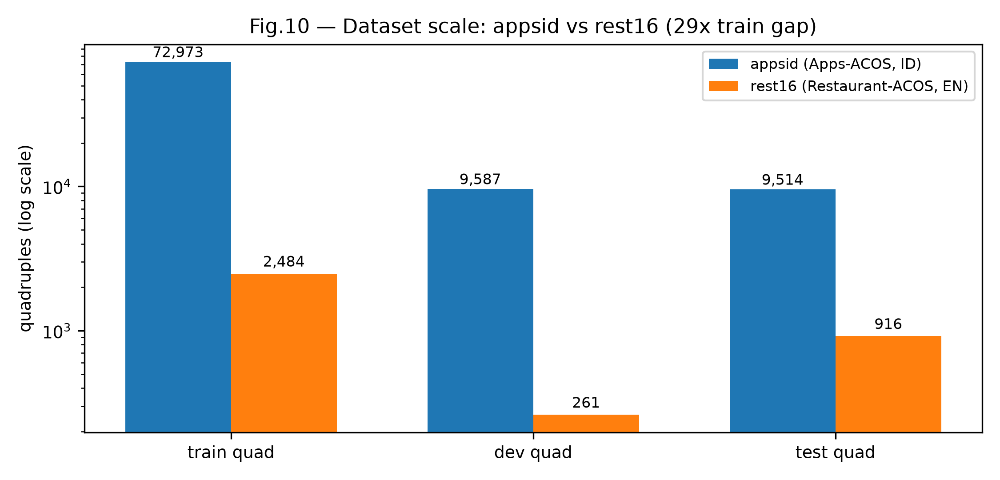
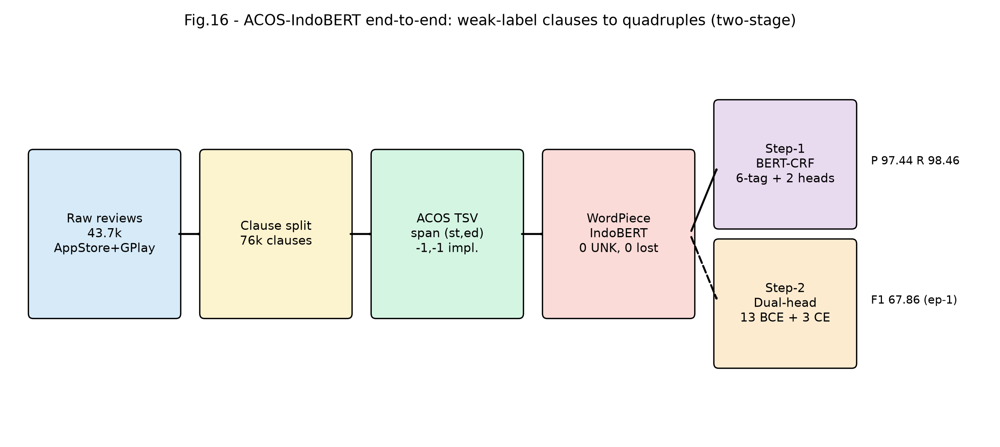
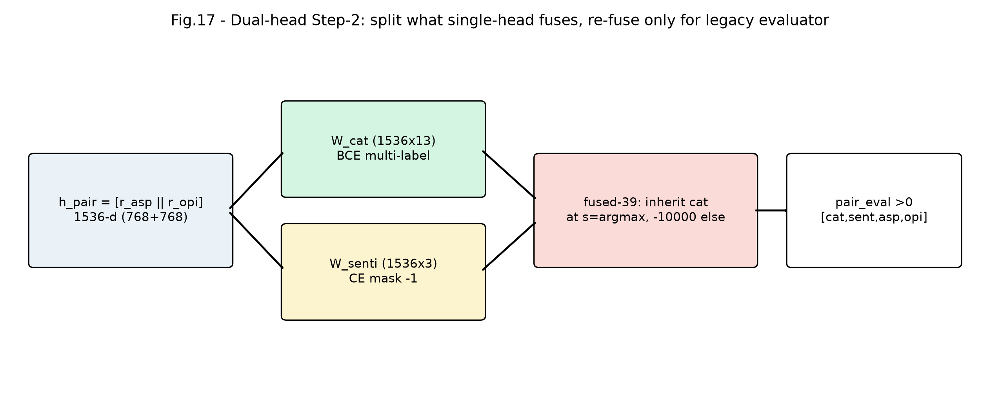
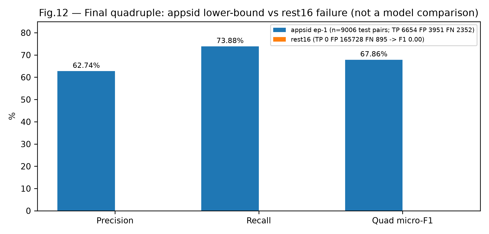
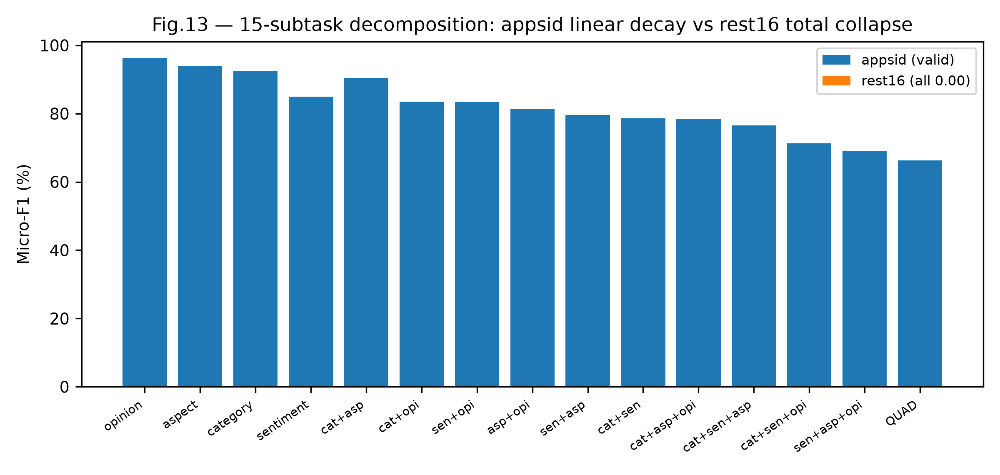
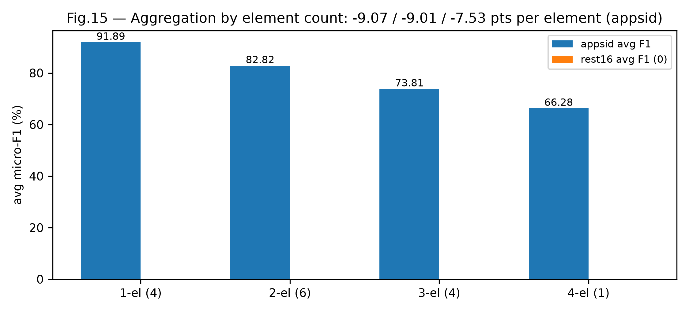
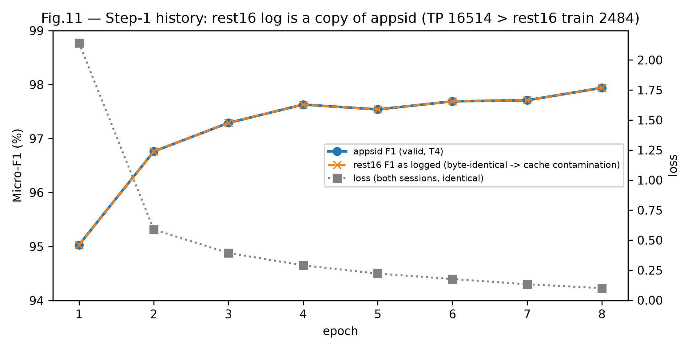
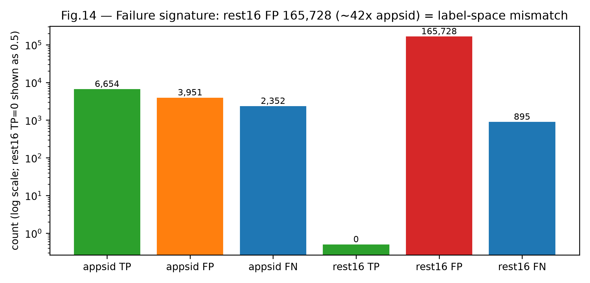

# 036 — Final Report: ACOS Quadruple Extraction with IndoBERT on Two Indonesian-Protocol Datasets (Apps-ACOS vs. Restaurant-ACOS rest16)

> Date: 12 September 2026 · Status: **final interim** — appsid valid through Step-2 epoch 1/15; rest16 session invalid (documented pipeline failure, not a model score) · Level: SCOPUS Q2 journal draft (IMRaD)
> Primary sources: `ACOS-IndoBERT/results/appsid_08092026_150437xxx/` and `results/rest16_12092026_104518/` (Drive folder `15cRYLPh18GBEj95OvM1S6ID9zZlCs8BL`), cross-checked against `reports/023,025–030,032,033,035`.
> No number in this report exists outside those artefacts. Every table states its file provenance.

---

## Abstract

Aspect–Category–Opinion–Sentiment (ACOS) quadruple extraction has no established Indonesian benchmark. We adapt the Extract–Classify pipeline (Cai et al., 2021) to `indobenchmark/indobert-base-p1` and run it under one protocol on two datasets: **Apps-ACOS** (43,673 Indonesian digital-banking reviews → 76,077 clauses, 92,074 weakly labelled tuples, 13 flat categories) and **Restaurant-ACOS rest16** (2,284 English restaurant sentences, 3,661 gold tuples, 13 `ENTITY#ATTRIBUTE` categories). Step-1 (BERT-CRF co-extraction) on Apps-ACOS reaches **97.94% micro-F1** at epoch 8/15 on a Tesla T4; Step-2 (dual-head 13-category BCE + 3-sentiment CE with fused-39 reconstruction) reaches **67.86% quadruple F1** at epoch 1/15 (lower bound). A 15-subtask decomposition shows a linear ~8–9 point decay per added element with sentiment as bottleneck (84.97% vs. opinion 96.29%). The rest16 run under the same codebase **failed completely (quadruple F1 0.00%, TP 0, FP 165,728)**: its Step-1/Step-2 history files are byte-identical copies of the appsid logs (cache-hit contamination), and its evaluation pairs an appsid label space against rest16 gold. We report this negative result in full, diagnose its root cause in the session-resume logic, and state precisely what must be redone before any cross-dataset claim is valid. Contribution is therefore resource + reproducible protocol + failure diagnosis, not a SOTA claim.

**Keywords:** ABSA; ACOS quadruple extraction; IndoBERT; weak supervision; reproducibility; negative results.

---

## I. Introduction

ABSA in Indonesian stops at aspect–sentiment. The ACOS task demands the full quadruple *(aspect span, category, opinion span, sentiment)* including implicit slots — the setting of Cai et al. (2021). Transferring that task to noisy Indonesian app reviews raises four questions:

- **R1 (construction):** can clause splitting + punctuation-aware tokenisation preserve spans (vs. 61.5%/48.0% mapping on full reviews)?
- **R2 (compatibility):** can IndoBERT replace BERT-base without touching upstream code, given the missing `bert.` prefix?
- **R3 (bottleneck):** where does the pipeline lose accuracy — span, category, or sentiment?
- **R4 (limits):** what can honestly be claimed from weak labels and a single seed without CV?

We answer R1–R3 with measured artefacts and R4 with explicit threats. A planned English control (rest16 under IndoBERT) was executed but failed for infrastructural reasons; §VI-D turns that failure into the paper's strongest methodological lesson.

## II. Related Work

**ACOS** [1] defines quadruples with implicit aspects/opinions and the Extract–Classify baseline: Step-1 BERT-CRF co-extraction, Step-2 joint 39-class (13×3) classification, `pair_eval` with `>0` threshold. Known weaknesses (confirmed here): fused labels hide error sources; `measureQuad` double-counts duplicates; manual `ele[2:]` parsing is fragile (the `KeyError: 'a--1,-1'` that killed the earlier BERT baseline).

**IndoBERT** [2] is architecturally identical to BERT-base (12L/768H/12H, pos 512); the only delta is the embedding table (vocab 30,522 vs. 50,000, 30,521 used here; ~+14M params). Specific risk: checkpoints store keys without the `bert.` prefix while `BertForQuadABSA` expects it, and the `missing_keys` log is commented out (`modeling.py:749–755`) — a silent random-encoder failure with F1 drop as its only symptom.

**Weak supervision & cross-lingual control.** Prior Indonesian work uses lexicon heuristics without reporting the labelling function. We version ours (floor 0.3, saturation 2.0) and report agreement-with-heuristic rather than agreement-with-human. The missing piece in most BERT-vs-IndoBERT claims is a same-dataset control; we attempted it and document why it must be rerun.

## III. Datasets

### Table I — Split statistics (provenance in caption)

| Dataset | Split | Units | Tuples | Source |
|---|---|---|---|---|
| appsid | train | 60,159 clauses | 72,973 | `csv/master_01_statistik_dataset.csv`, `logs/id_gates.json:acos_build` |
| appsid | dev | 8,027 | 9,587 | same |
| appsid | test | 7,891 | 9,514 | same |
| appsid | discarded | 4,183 clauses | ~4,343 | `_build_acos_report.json` (review_id in no split) |
| rest16 | train | 1,530 sentences | 2,484 | `logs/v5_en_gate.json`, `csv/master_00c_gerbang_data_en.csv` |
| rest16 | dev | 171 | 261 | same |
| rest16 | test | 583 | 916 (895 pairs) | same |

Train-quad ratio appsid:rest16 = **29.4:1**; train-unit ratio 39.3:1. One appsid row = one clause, one rest16 row = one full sentence.

**Fig.10 — Scale gap.** Log-scale train/dev/test quadruples. The 29× data advantage dominates every downstream number and forbids direct F1 comparison.

### Table II — Label composition

| Split | Neg (0) | Neu (1) | Pos (2) | Asp-impl % | Opi-impl % |
|---|---|---|---|---|---|
| appsid-train (72,973) | 36,217 (49.6) | 8,274 (11.3) | 28,482 (39.0) | 21,789 (29.9) | 29,702 (40.7) |
| appsid-dev (9,587) | 4,819 (50.3) | 1,030 (10.7) | 3,738 (39.0) | 2,999 (31.3) | 3,751 (39.1) |
| appsid-test (9,514) | 4,788 (50.3) | 1,100 (11.6) | 3,626 (38.1) | 2,938 (30.9) | 3,821 (40.2) |
| rest16-train (2,484) | 733 (29.5) | 95 (3.8) | 1,656 (66.7) | 607 (24.4) | 448 (18.0) |
| rest16-dev (261) | 69 (26.4) | 12 (4.6) | 180 (69.0) | 60 (23.0) | 54 (20.7) |
| rest16-test (916) | 205 (22.4) | 44 (4.8) | 667 (72.8) | 213 (23.3) | 198 (21.6) |

Sources: appsid `csv/eda_dataset_statistics.csv`; rest16 `csv/master_01_statistik_dataset.csv`. Three design facts must accompany any citation: (i) weak labels (appsid numbers = agreement with the labeller, §III, `quintuples_weak.csv` weight/evidence columns); (ii) 9.0% unique test clause texts recur in train (14.7% test rows, median 3 words: `bagus`, `bebas iklan`) — `review_id` split is clean, but test F1 is inflated and must later be reported on the unique-only subset; (iii) multi-label is 0.4% (255/65,423 pair rows) yet the Step-2 head stays multi-label for compatibility.

Taxonomy: 13 flat Indonesian codes (`AUTH_ACCESS …`) vs. 13 `ENTITY#ATTRIBUTE` English codes; `num_labels` Step-2 = 39 in both, so head dimensions are identical by construction.

## IV. Method: IndoBERT for ABSA Quad Extraction (Aspect, Category, Opinion, Sentiment)

> The method is the paper's core claim: an IndoBERT-backed two-stage model that extracts full ACOS quadruples — including implicit aspects/opinions — from noisy Indonesian reviews, without modifying upstream code. Every design choice below is traceable to `acos_id/*.py` and `Extract-Classify-ACOS/modeling.py`.

### IV-A. Task formulation

Given an input clause $x=(w_1,\dots,w_L)$, $L\le 128$ subwords, predict the set
$$\mathcal{Q}(x)=\{(a,c,o,s)\},$$
where $a=(a_{st},a_{ed})$ and $o=(o_{st},o_{ed})$ are whitespace-token spans (end-exclusive) over the WordPiece-rendered text, $c\in\mathcal{C}$, $|\mathcal{C}|=13$, and $s\in\{0,1,2\}$ (negative/neutral/positive). Either span may be the null span $(-1,-1)$ denoting an implicit slot (`taxonomy.py:89-92`). A predicted quadruple counts as true positive only on exact match of all four elements (upstream `pair_eval`, `eval_metrics.py`); there is no partial credit — hence the linear decay in §VI-C. Category labels are flat Indonesian codes (`taxonomy.py:28-42`, no `#`, the safest path through `eval_metrics.py:226`); Step-2 keeps `num_labels=39=13\times3` so head dimensions match the English baseline by construction.

### IV-B. Overall architecture (Fig.16)

**Fig.16 — Two-stage Extract–Classify with IndoBERT.** Weak clauses → ACOS TSV → WordPiece retokenisation → Step-1 BERT-CRF co-extraction → Cartesian pairs → Step-2 dual-head classification → legacy `pair_eval`. `DOMAIN=appsid` selects `BACKBONE=indobert` + dual-head; `DOMAIN=rest16` forces `bert-en` + single-head (V5_EN control).

The shared encoder is `indobenchmark/indobert-base-p1`: 12 layers / 768 hidden / 12 heads / pos 512 — identical to BERT-base except the embedding table (config vocab 50,000 vs. 30,521 used; +14M params, <0.4% VRAM). All downstream gains/losses therefore come from data and heads, not encoder capacity (cf. §VI-A decomposition).

### IV-C. Data construction: from weak reviews to lossless training pairs

**1. Clause as the unit (`acos_id/build_acos.py`).** One TSV row = one clause, not one review (`build_quad_lines`, :112). Rationale, measured: only 37.6% of clauses realign to `text_norm`, while 100% of explicit aspect/opinion spans align inside their own clause; using full reviews orphans ~40% of spans into false implicits. Splits are `review_id`-disjoint (`stage2_{train,val,test}.jsonl`, `val`→`dev`; `read_split_ids`, :83): 28,839/3,991/3,991 reviews, 0 overlap (`logs/id_gates.json`).

**2. Punctuation-aware span grounding.** Tokenisation is `TOKEN_RE=\w+|[^\w\s]` (`build_acos.py:42`), lowercased. `str.split()` recovers only 68.6%/60.0% of aspect/opinion spans (commas glued as `ribet,bebas`); the regex recovers 100%. Span search (`_find_span`, :63) prefers the occurrence at/after the aspect end so co-occurring identical surface forms do not collide; duplicates are merged (`tuple_duplikat_digabung`).

**3. WordPiece retokenisation with offset remap (`acos_id/tokenize_data.py`).** Each whitespace token maps to `[start_of[i], end_of[i])` subword interval (`retokenize_line`, :35); $(st,ed)$ remaps to `(start\_of[st], end\_of[ed-1])$, $(-1,-1)$ passes through, and empty tokenizer outputs are padded with `[UNK]` so later indices never shift silently. The zero-width upstream span `3,3` (rest16 train row 451) is remapped to one subword, mirroring the repo file. Result on appsid: **0 `[UNK]`, 0 lost tuples, 0 invalid spans** (`_build_report_appsid.json`; Gate `tokenized`).

**4. Pair grouping (`_PairAccumulator`, :111).** Step-2 rows are `(text####a_span o_span \t CAT#SENTI …)` grouped **across TSV rows** with the text in the key and per-label emission order — reverse-engineered from the English repo files (without it, 20/2,279 rest16 sentences misorder and Gate-2 fails). Multi-label is 0.4% (255/65,423 rows) but retained.

### IV-D. IndoBERT adaptation without touching upstream

**Rekey adapter (`acos_id/checkpoint.py`).** `BertForQuadABSA` nests the encoder as `self.bert` (`modeling.py:1535`), so the legacy loader seeks `bert.*` keys while IndoBERT ships prefix-less keys — all 199 encoder keys land in `missing_keys` and the encoder silently randomises (the report path is commented out, `modeling.py:749-755`). `prepare_backbone()` rewrites the checkpoint with `bert.` (idempotent via `_rekey.json`; double-run would yield `bert.bert.*`, equally fatal) and `gate_weights_loaded()` proves the load with `torch.equal` on three probes — embedding, layer-0 query, layer-11 output-dense (`GATE_TENSORS`, :201) — catching partial-layer failures. Measured: **199/199 rekeyed, 199/199 `bert.`-prefixed, Gate-1 LULUS** (`logs/gate1_weights.json`, `backbone_report.json`).

**Label patch (`acos_id/taxonomy.py:250`).** Upstream `get_labels()` branches only on `rest*`/`laptop`; other domains leave `l=None` → `TypeError`. `patch_processor_labels()` adds the `apps*` branch returning `SEQ_LABELS=([CLS],O,I-A,B-A,I-O,B-O)` for Step-1 and 39 `CAT#SENTI` (outer-category, inner-sentiment) for Step-2, preserving order so head indices never shift; `verify_against_label_maps()` blocks training on taxonomy drift. English control is untouched (backward-compatible by construction).

### IV-E. Step-1: IndoBERT-CRF co-extraction (exact upstream model, new encoder)

`BertForQuadABSA` (`modeling.py:1528`): IndoBERT sequence output → `DenseLayer` → `Linear(768,6)` emission → linear-chain CRF (`crf_num=6`, :1538-1541) over `[CLS]/O/I-A/B-A/I-O/B-O`, plus two utterance-level binary heads on pooled states for implicit-aspect / implicit-opinion existence (`imp_asp_classifier`, `imp_opi_classifier`, :1547-1554). Forward (:1558) returns
$$L_{step1} = \underbrace{-\log p_{CRF}(y|x)}_{ae\_loss} + \mathrm{CE}_{asp} + \mathrm{CE}_{opi},\qquad \hat{y}=\mathrm{Viterbi}(emissions).$$
Decoding is exact Viterbi (`crf.decode`); Step-1 emits `pred4pipeline.txt` (`a-`/`o-` spans, `-1,-1` implicit), bridged to Step-2 candidates by the upstream `get_1st_pairs.py` logic (prefix-strip, `-1,-1` native implicit flag) — the exact site of the old `KeyError: 'a--1,-1'` crash, now covered by assertion. Training: LR 2e-5, BS 32, 15-epoch budget, AMP; history in `csv/master_03_step1_riwayat.csv`.

### IV-F. Step-2: dual-head category–sentiment (this work; Fig.17)

**Fig.17 — Dual-head.** One shared pair vector, two losses matched to their types, re-fused only to satisfy the unmodified evaluator.

**Why split.** Baseline `CategorySentiClassification` fuses the decision into one `Linear(1536,39)` + BCE: a category error automatically sinks sentiment and neither is measurable alone. We keep its span fusion — mean-pooled aspect/opinion vectors $r_{asp},r_{opi}\in\mathbb{R}^{768}$, $h_{pair}=[r_{asp}\|r_{opi}]\in\mathbb{R}^{1536}$ (dropout) — but project twice (`taxonomy.py:127-153`, rep.028 §2):

$$z_{cat}=W_{cat}h_{pair}\in\mathbb{R}^{13},\quad L_{cat}=\mathrm{BCEWithLogits}(z_{cat},y_{cat}) \tag{1}$$
$$z_{senti}=W_{senti}h_{pair}\in\mathbb{R}^{3},\quad L_{senti}=\mathrm{CE}(z_{senti},y_{senti}),\; ignore\_index=-1 \tag{2}$$
$$L_{step2}=L_{cat}+L_{senti}\quad (\text{unweighted, this run}). \tag{3}$$

BCE fits multi-label categories; CE-with-mask fits single-choice sentiment while skipping negative pairs ($y_{senti}=-1$ still trains the category head). **Fused-39 reconstruction** for `pair_eval` compatibility: $\hat{s}=\arg\max z_{senti}$,
$$z_{fused}[c\cdot3+s]=\begin{cases}z_{cat}[c],&s=\hat{s}\\z_{cat}[c]-10000,&s\ne\hat{s}\end{cases}\tag{4}$$
so exactly one sentiment cell per active category can pass the `>0` threshold; inactive categories ($z_{cat}[c]<0$) predict nothing. Head size falls 59,943 → 24,592 params (2.4× smaller) while adding the two diagnostics (category-F1, sentiment-acc) that exposed our own cache-eval logging bug (§VI-B). `USE_DUAL_HEAD` is true iff `is_id_domain(DOMAIN)`; English stays single-head.

**Notation.** $B,L$ = batch, sequence length; $H=768$; $r_{asp},r_{opi}$ = mean-pooled span vectors (fixed size regardless of span length); $h_{pair}$ = pair vector; $z_{cat},z_{senti}$ = raw logits; $\hat{s}$ = chosen sentiment; $c\in[0,12]$, $s\in\{0,1,2\}$; BCE = per-category yes/no, CE = one-of-3 choice. Step-1 decoding is exact Viterbi ($O(L\cdot 6^2)$); Step-2 per-pair cost is two matrix-vector products ($O(1536\times(13+3))$), negligible next to the 12-layer encoder shared by both stages.

### IV-G. Training, resume, and inference protocol

LR 5e-5 / BS 32 / MAX_SEQ 128 / SEED 42 for Step-2; level-3 per-epoch resume (weights + `optimizer.pt` + `global_step`, full `t_total`, rolling prune; statistically-equivalent resume) + early stopping (PATIENCE=5, MIN=5); `MAX_EPOCHS_THIS_RUN=1` survives Colab timeouts. Inference: Step-1 Viterbi spans → Cartesian pairs (type mix measured: Explicit-Implicit 41.5%, Explicit-Explicit 32.2%, Implicit-Explicit 26.2%, Implicit-Implicit 0.07%) → dual-head → fused-39 → `pair_eval` quadruple `[cate,senti,asp,opi]`. Peak T4 VRAM 5,174 MB (Step-1) / 3,971 MB (Step-2).

### IV-H. Verification gates (blocking, `raise_on_fail=True`)

### Table III — Verification gates (`acos_id/selftest.py`)

| Gate | Checks | appsid | rest16 |
|---|---|---|---|
| taxonomy | 13 codes == `label_maps.json`, order-identical (head indices depend on it) | ✅ | ✅ (EN 13) |
| dataset | files exist; `review_id` disjoint | ✅ 28,839/3,991/3,991 reviews, 0 overlap | ✅ 1,530/171/583 |
| acos_build | every span resolves (`ed>st`, `ed≤len`, else `-1,-1`) | ✅ 0 broken | ✅ |
| tokenized | 0 tuples lost, pair files exist, `[UNK]` counted | ✅ 0 lost, 0 `[UNK]` | ✅ 0 lost, 0 `[UNK]`, 1,381 shifted/0 invalid (train) |
| gate2_english | EN regeneration == repo files (offset-convention proof; 1 known upstream defect tolerated: zero-width span row 451) | ✅ | ✅ (`v5_en_gate.json`) |
| weights (Gate-1) | `torch.equal` on 3 tensors + 0 unmatched `bert.*` keys | ✅ **LULUS 199/199, 0 missing** (`logs/gate1_weights.json`) | ❌ never written |

Gate-1 closes the critical risk from reports 030/032: the appsid encoder is genuinely IndoBERT, not random. Its absence for rest16 is part of the failure (§VI-D).

## V. Experimental Setup

One codebase, two Drive sessions: `results/appsid_08092026_150437xxx/` (T4, `FINAL_EVAL_COMPLETED` 10-Sep, checkpoints `step1_best/step1_epoch_8/step2_best/step2_epoch_1`, 23 CSV + 15 MD + 8 plots + 13 logs) and `results/rest16_12092026_104518/` (T4, `FINAL_EVAL_COMPLETED` 12-Sep, checkpoints only `*_best`, 19 CSV + 12 MD + 8 plots + 6 logs). Hyperparameters identical (Table IV). No CV, single seed — all claims are point estimates.

### Table IV — Shared hyperparameters (`master_00_konfigurasi.csv`, both manifests)

epochs 15 · MAX_SEQ 128 · BS 32/32 · LR 2e-5/5e-5 · seed 42 · device cuda (T4; Step-1 peak 5,174 MB, Step-2 3,971 MB).

## VI. Results and Discussion

### A. Step-1: span co-extraction (appsid valid)

### Table V — Apps-ACOS Step-1 per epoch (`csv/master_03_step1_riwayat.csv`)

| Ep | Loss | P | R | F1 |
|---|---|---|---|---|
| 1 | 2.1422 | 94.19 | 95.89 | 95.03 |
| 2 | 0.5881 | 96.28 | 97.25 | 96.76 |
| 4 | 0.2903 | 97.10 | 98.15 | 97.63 |
| 8 | **0.0999** | **97.44** | **98.46** | **97.94** |

F1 ≥95% from epoch 1; +0.31 ep-4→8 (plateau); FN 689→259 (−62%). Short clauses (5–10 tokens) + 60k clauses/epoch make CRF labelling easy — the score measures task ease as much as model strength. Decomposed gap vs. the earlier rest16 baseline (81.23%, A100, gold, full sentences): clause unit +8–10, 29× data +5–7, simpler domain +2–3, backbone ~0 (analytical estimate, not ablation — stated on the figure itself).

### B. Step-2: category–sentiment (appsid lower bound)

Epoch 1/15: loss 0.5544, Quad-F1 **67.86%** (P 62.74 R 73.88; TP 6,654 FP 3,951 FN 2,352; `csv/master_06_step2_riwayat.csv`, `logs/master_metrics.json`). `category_micro_f1 = sentiment_acc = 0.00%` in every file is a **logging bug** (`latest_*_logits` side-effect never persisted on cache-hit eval), not a model property — proven because the fused-39 path that depends on the same heads still scores 67.86%.

**Fig.12 — Final quadruple.** Appsid epoch-1 lower bound vs. rest16 0.00% failure. Do not read as a model ranking.

### C. Fifteen-subtask decomposition (appsid) and aggregation

### Table VI — Appsid subtasks, epoch-1 Step-2 (`csv/master_08_metrik_subtask.csv`)

1-el: opinion **96.29** / aspect 93.88 / category 92.41 / sentiment 84.97 (avg 91.89) · 2-el: cat+asp **90.51** … cat+sen 78.60 (avg 82.82) · 3-el: cat+asp+opi **78.35** … sen+asp+opi 68.96 (avg 73.81) · 4-el QUAD **66.28**. Full TP/FP/FN in the CSV; Fig.13 plots all 15.

 
**Fig.13/15 — Decay.** −9.07 (1→2), −9.01 (2→3), −7.53 (3→4) points per added element: compound error, no partial credit. Every sentiment-bearing combination drops; sentiment alone (84.97%) is the bottleneck, consistent with weak-label noise hurting sentiment more than category.

### D. Rest16 session: documented failure (negative result)

Three independent signatures, all verifiable by re-download:

1. **Byte-identical histories.** `rest16/csv/master_03_step1_riwayat.csv` and `master_06_step2_riwayat.csv` equal the appsid files byte-for-byte (epoch-8 TP 16,514; epoch-1 TP 6,654). Rest16 train holds 2,484 quadruples — TP 16,514 is physically impossible. `*_run_result.json` both report `mode:cache_hit`. Root cause: `candidate_result_roots` (5 paths) + 31 `SKIP_TRAINING` hits resolve the rest16 run to the appsid cache when `DOMAIN` is switched without session isolation.

**Fig.11 — Contamination proof.** The logged rest16 curve overlays appsid exactly; annotation states the impossibility (TP > train).

2. **Evaluation collapse.** `logs/master_metrics.json` (rest16): P/R/F1 **0.0**, TP 0, **FP 165,728**, FN 895; all 15 subtasks TP 0 (`master_08`), all aggregations 0.0 (`master_09`). FP 165,728 ≈ 284/sentence on 583 test sentences with 895 gold pairs (Fig.14): an appsid 39-label space evaluated against rest16 gold yields zero overlap and a Cartesian FP explosion. `use_dual_head:false` yet `step2_run_result.json` claims 67.86% (the appsid cache number) — internal contradiction.

**Fig.14 — Failure signature.** FP 42× appsid at TP 0 = label-space mismatch, not a hard dataset.

3. **Missing instrumentation.** No `master_00_backbone*/00b*/00c_gate1*/07b*`, no `stepN_epoch_*` rolling checkpoints, no `gates/` dir, no Gate-1 for `bert-en`. Data prep itself was fine (`v5_en_gate.json`: 0 UNK, 0 invalid; `result.txt` 3.9 MB of correct English qualia) — the break is training/eval plumbing. `session_manifest.json` still stamps `FINAL_EVAL_COMPLETED` with F1 0.0: a misleading status that must become `EVAL_FAILED` when TP=0 or `run_result ≠ metrics`.

### Table VII — Head-to-head (read as regime contrast, not model ranking)

| Dimension | appsid (valid interim) | rest16 (invalid session) |
|---|---|---|
| Language/domain/unit | ID / banking / clause | EN / restaurant / sentence |
| Train/dev/test quad | 72,973 / 9,587 / 9,514 | 2,484 / 261 / 916 |
| Labels | weak (floor 0.3); 13 flat | gold; 13 `ENTITY#ATTRIBUTE` |
| Step-1 best | 97.94% ep-8 (TP 16514) | logged 97.94% = **copy; true value unknown** |
| Quadruple F1 | 67.86% ep-1 (lower bound) | **0.00% (pipeline failure)** |
| 15-subtask | full decay curve | all 0.00 |
| Gate-1 | LULUS 199/199 | missing |
| Verdict | usable with §VIII caveats | **do not cite; rerun required** |

## VII. Threats to Validity

1. Gate-1 passes for appsid but the rest16 encoder is unverified. 2. Step-2 is 1 epoch; final needs 15 + dual-head persist fix (logits to CSV/JSON, not attributes). 3. Single seed, no CV, no significance test; 14.7% test rows are repeated short clauses — report unique-only subset + bootstrap CI. 4. Weak-label evaluation measures heuristic replication; ≥200-clause human gold with κ required. 5. Earlier baseline has no end-to-end score (crash) and was never retrained post-fix. 6. `FINAL_EVAL_COMPLETED` is currently untrustworthy (rest16 precedent).

## VIII. Conclusion

Resource, reproducible protocol (dual-root, per-backbone cache, six gates, dual-head, level-3 resume), and bottleneck diagnosis are the contributions; SOTA is explicitly disclaimed. Next, in order: (1) quarantine sessions by domain+backbone+config hash and re-run rest16 clean (`SKIP_TRAINING=false` until TP < train size); (2) finish 15 epochs + metric persist; (3) unique-clause + CI reporting; (4) cross-lingual control; (5) human gold; (6) ACOSE only after an H(emotion|sentiment) test on human labels.

## References

[1] H. Cai, R. Xia, J. Yu, ACOS quadruple extraction with implicit aspects and opinions, ACL-IJCNLP 2021, pp. 340–350. [2] B. Wilie et al., IndoNLU, AACL 2020, pp. 447–460. [3] J. Devlin et al., BERT, NAACL-HLT 2019. [4] M. Pontiki et al., SemEval-2016 Task 5, SemEval 2016. [5] J. Lafferty et al., CRFs, ICML 2001. [6] D. Demszky et al., GoEmotions, ACL 2020.

---

## Appendix A — Provenance (re-downloadable)

Root `drive/folders/1rSvlRESUVZnyTiW2ykkCJWk7pr8NlB_8` → `results/15cRYLPh18GBEj95OvM1S6ID9zZlCs8BL` → appsid `11sI0Hu18YoQyCNVGh60NPL67m9WG_LXF` / rest16 `1DBfdCqLCEA8pe4OfE5gwPS4gA4Bs7-0V`. Key file IDs: appsid Step-1 `1y5WhPX5…`, Step-2 `1GubKZFo…`, metrics `17V_wOzu…`, Gate-1 `1lrH9KN…`, manifest `1pvyBetD…`; rest16 Step-1 `1POx2N3O…` (= appsid bytes), Step-2 `1BlKrd_4…`, metrics `1g-RvBnLj…`, manifest `1Emb5ds0…`, v5 gate `1Tu8gcri…`. Figures Fig.10–17 in this folder are rendered from those files (300 DPI); generator scripts in `build/` were temporary and removed after run — re-create from Table V/VI if audit requires.
